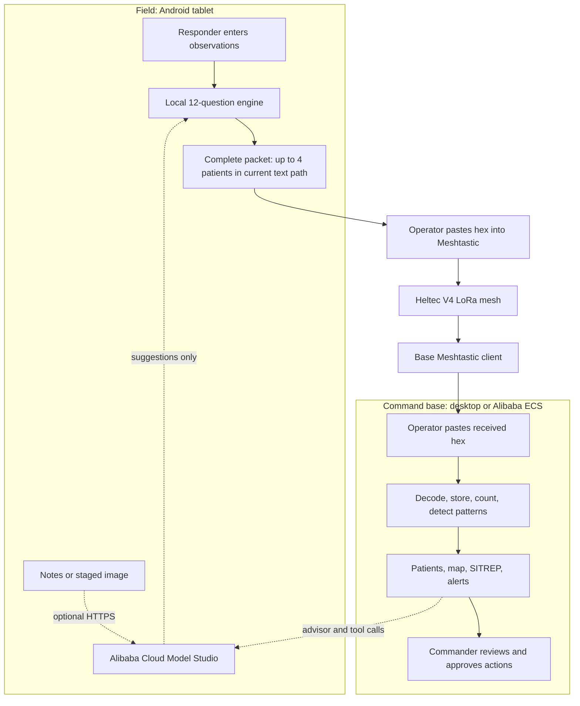
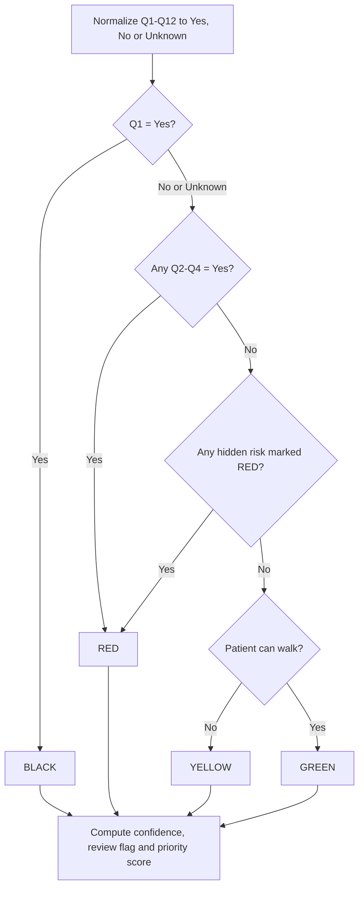
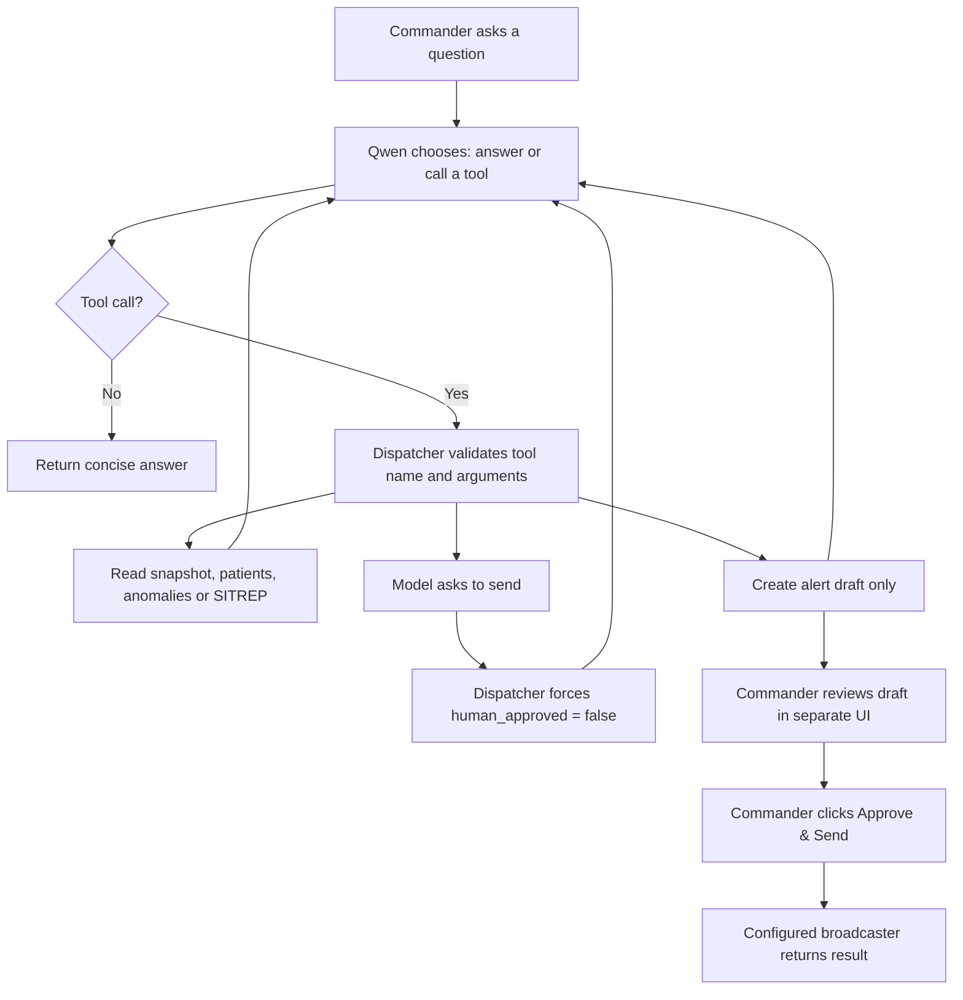
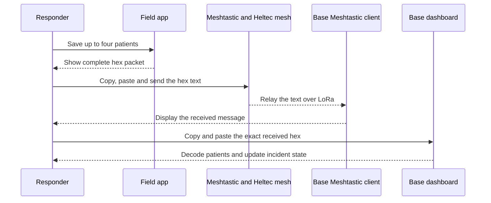
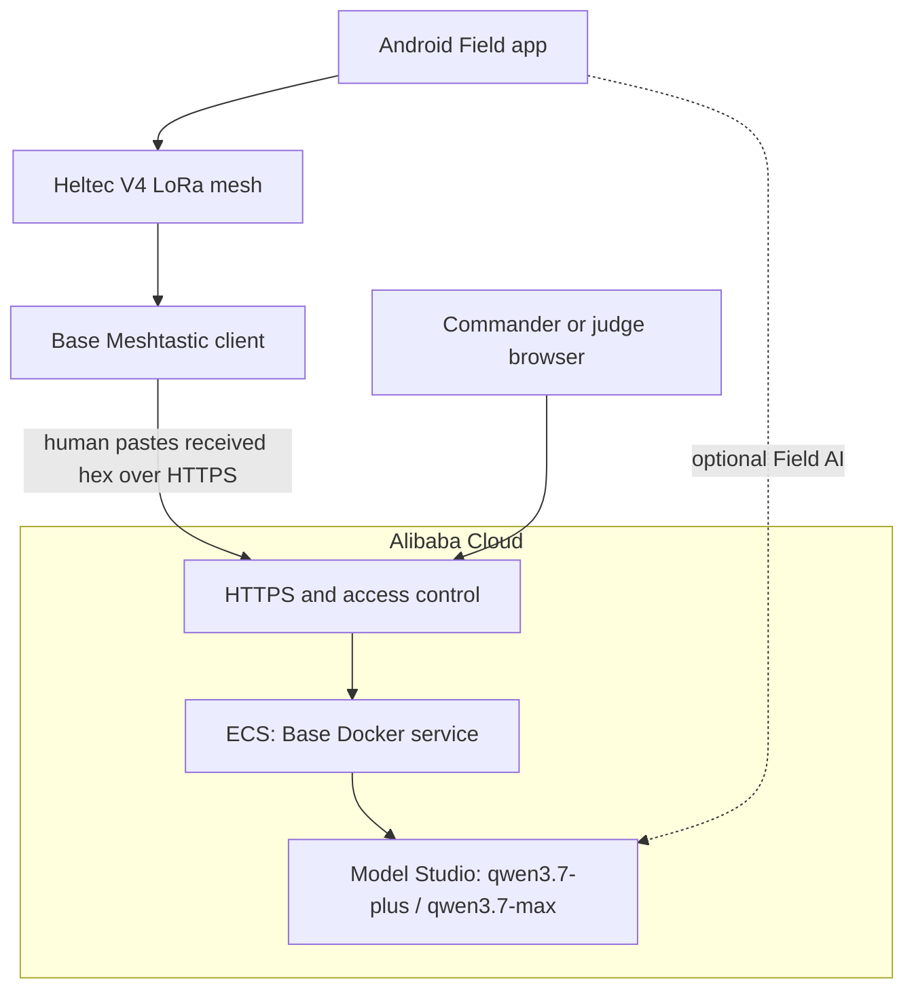

# EmergencyNet

**A disaster-response system that keeps triage and field-to-base reporting working when mobile internet is weak or unavailable.**

[繁體中文](README.zh-TW.md) · [Setup](docs/SETUP_GUIDE.md) · [Test and live demo](docs/TESTING_GUIDE.md) · [Alibaba Cloud deployment](docs/ALIBABA_CLOUD.md) · [Project story](docs/PROJECT_STORY.md)

> **Prototype status:** EmergencyNet is a hackathon and engineering prototype, not a certified medical device. Its clinical rules and guidance need review by qualified local medical and incident-command leaders before any real exercise or deployment. Public demos must use synthetic data.

## What EmergencyNet does—in plain English

A responder enters a patient's condition on an Android tablet. The tablet runs a fixed 12-question checklist locally and assigns a BLACK, RED, YELLOW, or GREEN triage tag. It also checks for eight dangers that can be easy to miss when a patient still looks stable, such as a delayed airway problem after a facial burn or complications after prolonged entrapment.

The tablet converts the result into a small packet. In the current prototype, the responder copies that packet as hexadecimal text into the Meshtastic Android app. Heltec LoRa 32 V4 radios carry the message across a LoRa mesh. At the command base, an operator copies the received text into the EmergencyNet Base dashboard.

The Base dashboard combines reports from multiple patients. It shows patient counts, builds a situation report, and warns the commander when it sees a pattern—for example, breathing problems across at least half of a recent group, or three trapped patients.

Qwen Cloud is used where language and synthesis help: reading multilingual notes, reviewing a staged image, preparing short field advice, summarizing the incident, and drafting a radio alert. Qwen does **not** own the triage tag, cannot change Yes to No, and cannot approve its own broadcast.

That is the whole project:

```text
patient observation
    → local 12-question triage
    → compact hex packet
    → Meshtastic LoRa mesh
    → Base aggregation and pattern detection
    → Qwen-assisted advice and drafts
    → human decision
```

Five terms used throughout this README:

| Term | Meaning here |
|---|---|
| Field | The responder, Android tablet, and radio at the incident scene |
| Base | The command-side dashboard, usually on a desktop or Alibaba ECS host |
| Triage tag | The prototype priority label: BLACK, RED, YELLOW, or GREEN |
| SITREP | A short situation report built from all records currently at Base |
| Mesh | Several radios relaying a message so the endpoints do not need a direct link |

## What is working today

This table separates the current implementation from planned work.

| Area | Working now | Not yet connected |
|---|---|---|
| Field triage | Android/desktop Gradio form, deterministic 12-question logic, hidden-risk checks, confidence, priority | Clinical validation and hard validation of every contradictory vital-sign input |
| Field AI | Multilingual notes, image review, tactical synthesis through Qwen Cloud | Offline local LLM |
| Radio | Operator copies hex into Meshtastic; Heltec V4 nodes relay the text over LoRa mesh | Direct binary transmission from the Field app |
| Base receive | Operator copies received Meshtastic hex into **Inject test packet** | Automatic capture from the Base radio in the normal demo path |
| Base operations | Decode, patient table, map, SITREP, four aggregate detectors, Qwen advisor and tool agent | Durable database and replay/deduplication protection |
| Outbound messages | Qwen drafts, human approval gate, audit result | Default broadcaster is a stub; real Base-to-radio sending is not wired |
| Alibaba Cloud | Model Studio API client, Docker image and ECS deployment guide | The supplied archive contains no ECS runtime proof, public URL, instance ID, or region |

We make these boundaries explicit because a disaster system should not claim a capability that has not been tested end to end.

## The problem we are solving

In a mass-casualty incident, two information problems happen at the same time.

At the scene, a small team may need to assess dozens of people. The obvious cases get attention first, but a responder can miss a patient who looks stable and has a delayed risk. The responder is also expected to remember patient details, choose a priority, communicate with base, and keep moving.

At the command base, the opposite problem appears. The commander receives short, separate messages from different teams. One report about breathing difficulty may be an isolated case. Five similar reports may mean smoke, chemical exposure, or another shared hazard. The commander needs the combined picture, not five disconnected conversations.

Internet-dependent software is a poor single point of failure for this job. EmergencyNet therefore divides responsibility:

| Design choice | Why we made it |
|---|---|
| Fixed local triage rules | The same input should produce the same result, even with no API key or internet |
| 12 short questions | A fixed checklist reduces memory load and fits exactly into three packet bytes at two bits per answer |
| Separate hidden-risk checks | Immediate START-style signs do not cover every delayed danger visible in the project requirements |
| AI may only suggest No → Yes | AI can call attention to a missed clue, but cannot erase an observed danger or silently lower priority |
| LoRa mesh | Field teams can relay small messages without depending on a surviving cellular network |
| Aggregate detectors at Base | The important signal may be a pattern across patients, not a detail in one record |
| Human approval for broadcasts | A plausible AI draft is not proof that the message is correct, necessary, or safe to transmit |
| Offline fallback | Losing Qwen should remove enrichment, not remove triage, radio packets, decoding, or SITREP |

## A concrete example

Suppose three people are found after a building collapse. All three are breathing rapidly, have burns, and have been trapped for 45 minutes.

1. The responder records each patient on the tablet.
2. Q2 becomes Yes because breathing is abnormal. Q5 becomes Yes because entrapment lasted at least 30 minutes. Q9 may become Yes if there are face/neck burns, soot, or hoarseness.
3. The deterministic engine marks the patients RED and explains which rules fired.
4. The Field app packs the three records into a 128-character hex message.
5. The operator sends that text through Meshtastic.
6. Base decodes all three records. Its burn detector and crush detector become active.
7. After two more RED patients with respiratory distress arrive, Base also raises the respiratory-cluster and RED-surge alerts.
8. The commander asks the Qwen agent for exact counts and a short alert draft.
9. The agent reads the live Base state through tools and creates a draft. It cannot send it.
10. The commander checks the evidence and decides what to do.

This example is included as ready-to-run synthetic data in [the testing guide](docs/TESTING_GUIDE.md).

## System architecture



### Who is allowed to decide what

| Component | It can do | It cannot do |
|---|---|---|
| Deterministic Field engine | Derive Q1–Q12, tag, risks, confidence and priority | Call the internet or delegate the final tag to AI |
| Qwen Field review | Read notes/images and suggest a currently-No answer should become Yes | Change Yes to No, apply a change without a person, or directly set a tag |
| Field responder | Accept/reject suggestions and send the packet | Treat a model suggestion as a final clinical decision without review |
| Base gateway | Decode reports, store patients, count and detect patterns | Re-triage patients with a shadow AI model |
| Qwen strategy advisor | Organize the live incident snapshot into findings, actions and uncertainties | Change tags, send broadcasts, or invent missing resources |
| Qwen tool agent | Read live Base state and create a short alert draft | Mutate patient data or approve its own send request |
| Commander | Review evidence and approve an operational action | Transfer final accountability to the model |

## The Field application

The Field application runs as a Gradio web app on the Android tablet through Termux/Ubuntu PRoot. It can also run on a laptop for testing.

The responder records:

- patient ID, team and zone;
- whether the patient can walk;
- estimated age and special markers;
- breathing category and optional respiratory rate;
- radial pulse and mental status;
- pain response and visible injury types;
- conditional details for pregnancy, burns and entrapment;
- optional notes, exercise image and manually supplied coordinates.

The application has four main areas:

1. **Patient form** — run the local algorithm, inspect the reasons, request optional Qwen review, accept/reject suggestions, and save a patient to the outbox.
2. **Tactical Advice** — combine fixed local care/equipment/transport/safety tables with Qwen synthesis for the next five minutes.
3. **Outbox & Send** — rank saved patients and create a complete hex packet for manual Meshtastic relay.
4. **Settings** — apply/test the Model Studio endpoint, key and model without storing the key from the UI.

## The 12-question algorithm

### Why use 12 questions?

The goal is not to replace a responder with a questionnaire. The checklist gives the responder a repeatable way to turn observations into a small, auditable record under pressure.

The first four questions cover immediate triage signs. The final eight look for conditions that may be less obvious or may deteriorate later. Every answer is one of `Yes`, `No`, or `Unknown`. In the packet, each answer uses two bits, so all 12 answers occupy exactly 24 bits, or three bytes.

The number 12 is an engineering choice in this prototype, not proof that these questions form a clinically complete universal protocol.

### What each question checks

| Q | Plain-language check | Current algorithm result when Yes | Why it is included |
|---:|---|---|---|
| Q1 | Still not breathing after airway repositioning | BLACK, checked first | This branch must take precedence over later RED conditions |
| Q2 | Respiratory rate outside the configured adult/pediatric range, or rapid/weak breathing | RED | Abnormal breathing needs immediate attention |
| Q3 | Radial pulse absent | RED | Used as the prototype's perfusion-failure signal |
| Q4 | Cannot follow a simple command | RED | Indicates an immediate mental-status concern |
| Q5 | Trapped for at least 30 minutes | Hidden-risk RED | Prolonged entrapment can create danger during/after release |
| Q6 | Abdominal pain after blunt trauma | Hidden-risk RED | A patient can initially look stable despite internal injury |
| Q7 | Pregnant with abdominal pain, bleeding, or reduced fetal movement | Hidden-risk RED | Pregnancy changes the risk and transport picture |
| Q8 | New confusion, drowsiness, or unresponsiveness after trauma | Hidden-risk RED | Neurological deterioration can be delayed |
| Q9 | Face/neck burn, soot, or a hoarse voice | Hidden-risk RED | Airway swelling may worsen after the first assessment |
| Q10 | Significant injury but no pain | Hidden-risk RED | Painless injury may still require urgent reassessment |
| Q11 | Older adult with head impact and confusion | Monitoring risk; does not force RED by itself | The patient may need repeated neurological checks even if initially stable |
| Q12 | Close blast exposure while currently appearing well | Hidden-risk RED | Blast-related respiratory problems can appear later |

These descriptions explain the software logic. The medical thresholds, timelines and embedded action text remain prototype content requiring qualified review.

### Tag decision order



The order matters. Q1 returns BLACK before the engine considers RED flags. If Q1 is not Yes, the engine continues; an Unknown Q1 also lowers confidence and requires human review. Any immediate RED flag or RED-level hidden risk then returns RED. Only a patient with none of those conditions reaches the walk/non-walk split.

### Confidence and human-review flag

The current confidence formula is:

```text
confidence = 1 − (number of Unknown answers ÷ 12)
```

If Q1, Q5, Q6, Q7 or Q9 is Unknown, confidence is capped at `0.4` and the record is marked for human review. Confidence below `0.6` also marks the record for review.

There is an unresolved validation issue: Q2/Q3 Unknown currently does not guarantee a review flag, and contradictory input such as `breathing=normal` with `RR=0` is not hard-blocked. We have not silently changed clinical policy. The limitation is documented so a qualified owner can decide whether to reject the input, force review, or change tag behaviour.

### Priority score

The tag is the main decision. A separate deterministic score only sorts patients inside the same operational view. It starts with a tag score and adds configured bonuses for hidden risks, combined respiratory/perfusion flags, airway concern and special populations. Safety-critical Unknown values subtract points. The score is an ordering aid, not a second diagnosis.

## The eight hidden-risk checks

Immediate triage asks, “Who needs attention now?” The hidden-risk layer asks a different question: “Who may look less urgent now but has a reason to deteriorate or need a different resource?”

That separation is intentional. If the two ideas were mixed into one unexplained model output, the responder could not see why the tag changed. EmergencyNet instead shows the exact question, risk name, current severity level, reason and prototype action text.

| Question | Risk label in the code | Current level | What the software is trying to prevent |
|---|---|---|---|
| Q5 | Crush release syndrome | `RED_WITHIN_HOUR` | Overlooking a trapped patient's post-release risk |
| Q6 | Occult internal haemorrhage | `RED_WITHIN_HOUR` | Assuming stable-looking vital signs exclude internal injury |
| Q7 | Placental abruption | `RED_NOW` | Treating pregnancy trauma like an ordinary minor injury |
| Q8 | Progressive neurological deterioration | `RED_WITHIN_HOUR` | Missing a worsening head/neurological condition after an initially responsive period |
| Q9 | Delayed airway obstruction | `RED_WITHIN_HOUR` | Waiting until airway swelling is obvious |
| Q10 | Neurogenic shock / spinal-cord injury | `RED_WITHIN_HOUR` | Treating lack of pain as proof that an injury is minor |
| Q11 | Older-adult subdural haematoma | `MONITORING_REQUIRED` | Discharging attention from an older head-injury patient too early |
| Q12 | Primary blast-lung injury | `RED_WITHIN_HOUR` | Assuming a blast-exposed patient is safe because symptoms are delayed |

## Where Qwen is used—and why

EmergencyNet does not send every decision to one large model. Each AI feature has one narrow job and a defined failure behaviour.

| Feature | Input | Output | Model | Why AI helps | Hard boundary |
|---|---|---|---|---|---|
| Notes review | Free text plus current Q1–Q12 | Candidate No → Yes changes with reasons | `qwen3.7-plus` | Responders may record useful clues outside fixed form fields | Parser discards de-escalation and changes to Yes/Unknown answers; person must accept |
| Multilingual review | Notes in the responder's language | English rendering plus the same safe candidate changes | `qwen3.7-plus` | One model can interpret the note directly without a separate translation hop | No separate translation model; same No → Yes filter |
| Exercise-image review | Staged image plus form summary | Visual findings and candidate changes | `qwen3.7-plus` | A model can point out a visible clue the form missed | Image must be staged/synthetic; image never enters the LoRa packet; person accepts changes |
| Field tactical advice | Tag, risks, environment, visible injuries and local lookup tables | Five-minute advice, equipment, transport class, PPE and perimeter | `qwen3.7-plus` | Converts several fixed table entries into one short operational view | Equipment whitelist; transport cannot be downgraded; PPE/perimeter cannot go below baseline; table fallback works offline |
| Base strategy advisor | Exact live incident snapshot plus commander question | Summary, findings, actions, watch items and uncertainty | `qwen3.7-max` with thinking | Helps organize many records into a command-level answer | Cannot change tags or send; must state missing information; structured JSON repair/fallback |
| Base tool agent | Commander request | Tool results, exact counts, SITREP and short alert draft | `qwen3.7-plus` | Reads current program state instead of guessing from chat history | Six-step cap, no tag-changing tool, model-originated approval always overwritten |

### Why the deterministic rules stay outside the model

Model output can change between runs, network calls can fail, and a multilingual note can be ambiguous. Triage needs a traceable answer that still exists when the cloud does not. Qwen therefore adds evidence and synthesis around the fixed core; it does not replace that core.

### Why AI can raise a concern but cannot lower one

If structured data already says a danger is present, a model should not erase it because of a sentence or image interpretation. The review parser only keeps suggestions where the current value is `No` and the destination is `Yes`. Even those changes remain pending until the responder selects the qkey and presses **Apply accepted escalations & re-evaluate**.

This is a conservative software boundary, not a claim that every AI escalation is medically correct.

## How the Base tool-agent loop works

The Base agent is not a free-form chatbot with a copy of the README. It uses function calling to read live application state.

Its six tools are:

| Tool | What it returns or changes |
|---|---|
| `get_situation_snapshot` | Patient count, tag counts, hidden-risk counts, active anomalies and draft count |
| `list_patients` | Up to 50 recent patients with ID, tag, risks, injuries and age |
| `list_anomalies` | Current deterministic anomaly-detector output |
| `build_sitrep_md` | A deterministic Markdown situation report |
| `draft_mesh_alert` | Stores a draft with severity, anomaly type and a body capped at 180 characters; sends nothing |
| `request_send_broadcast` | Requests a send, but requires a separate human approval source |



Step by step:

1. The commander's request and a fixed system rule set are sent to `qwen3.7-plus`.
2. Qwen either returns text or asks to call one or more known tools.
3. The dispatcher rejects unknown tools and parses/limits arguments.
4. Tool results are appended to the conversation, so the next model step can use exact live data.
5. The loop stops when Qwen returns a final answer or reaches six model steps.
6. If Qwen creates a draft, the draft gets its own ID and `sent=false`.
7. If Qwen fabricates `human_approved=true`, the dispatcher overwrites it with `false` and returns `human_approval_required`.
8. Only the separate dashboard button calls the send function as approved after a human click.

The default broadcaster currently returns a demo stub result. Therefore the UI can prove the approval gate, but it cannot prove a radio transmission from Base.

### Why use tools instead of asking Qwen to “look at the situation”?

A text prompt can be stale or incomplete. Tools let the model request the current counts and make the call visible in an audit list. They also make permissions concrete: there is no tool for changing a tag, and drafting is a different operation from sending.

## Radio mesh and packet design

### Why LoRa mesh?

LoRa carries small messages over radio without requiring the same cellular infrastructure as a normal web application. Meshtastic adds node-to-node relay, so a message can pass through another Heltec node when endpoints cannot communicate directly.

EmergencyNet does not claim a measured range or reliability figure yet. Those results depend on frequency region, antenna, modem preset, terrain, placement and actual test records.

### The current manual path



Why use hex in this prototype? It is easy to display, copy and inspect using the existing Meshtastic text app, so the radio demonstration does not depend on an unfinished custom Android-to-radio bridge. The cost is size: one binary byte becomes two text characters.

### Packet layout

Each packet has a 10-byte header. Each patient uses 18 bytes.

| Part | Bytes | Contents |
|---|---:|---|
| Header | 10 | Version, team ID, timestamp, patient count, zone and XOR checksum |
| Patient identity/location | 7 | One-byte patient ID and fixed-point latitude/longitude |
| Tag/confidence | 1 | Two-bit tag and six-bit confidence |
| Twelve answers | 3 | Twelve two-bit Yes/No/Unknown values |
| Risk/walking flags | 1 | Q5–Q11 flags plus ambulatory bit; Q12 is reconstructed from answer bits |
| Compact observations | 5 | Age, injuries, special markers, breathing, pulse, mental state, pain, review flag and entrapment time |
| Patient checksum | 1 | XOR of the first 17 patient bytes |

The binary codec supports 12 patients:

```text
10-byte header + (12 × 18-byte patient) = 226 bytes
```

The current text route is different because hex doubles the length:

| Patients | Binary bytes | Hex text characters | Use in the current demo |
|---:|---:|---:|---|
| 1 | 28 | 56 | Safe |
| 3 | 64 | 128 | Safe |
| 4 | 82 | 164 | Default maximum |
| 5 | 100 | 200 | No margin; avoided |
| 12 | 226 | 452 | Does not fit one normal Meshtastic text message |

The Field UI therefore emits at most four patients per message and leaves the rest in the outbox for the next complete packet. It never splits one packet in the middle.

XOR catches accidental corruption. It is not a signature or message-authentication code. A real deployment still needs sender authentication, replay protection and key-management procedures.

## What happens at Base

When an operator injects a received packet, the Base gateway:

1. checks the header and patient checksums;
2. rejects malformed, truncated, concatenated or wrong-version packets without crashing the receiver;
3. decodes the patient records;
4. stores up to 500 recent patients in memory;
5. updates zone counts and a 30-patient anomaly window;
6. builds patient/SITREP views and evaluates the four pattern detectors;
7. optionally asks Qwen to organize the live snapshot or create a draft.

### Aggregate pattern detectors

| Alert | Current trigger | Why Base checks it |
|---|---|---|
| `RESP_CLUSTER` | At least 5 patients and at least 50% show rapid/weak or absent breathing | Several breathing cases may indicate a shared airborne, smoke or chemical hazard worth investigating |
| `BURN_CLUSTER` | At least 3 patients and at least 60% have burn injury | A burn pattern can change resource, scene and transport needs |
| `CRUSH_CLUSTER` | At least 3 patients are marked entrapped | Multiple trapped patients can justify structural-rescue coordination |
| `RED_SURGE` | At least 5 RED records within 10 minutes | A sudden rise in critical patients may require incident escalation |

These thresholds are current configurable prototype defaults, not validated universal emergency thresholds. Alerts do not change individual tags.

### Base dashboard views

- **SITREP** — deterministic summary of tag counts, zones and alerts.
- **Patients** — recent decoded patient records.
- **Agent / Drafts** — live-state tool agent and stored alert drafts.
- **Advisor** — `qwen3.7-max` strategy response with explicit uncertainty.
- **Inject test packet** — current manual Meshtastic receive boundary.
- **Map** — decoded patient coordinates plus optional position/civilian sources.
- **Civilian intake** — retained optional JSON intake for a separate app; not required for the core EdgeAgent demo.
- **Broadcasts / Compose Broadcast** — AI-assisted draft flow and human approval controls.
- **Settings** — Model Studio connection and models.

## What still works without internet or an API key

| Function | Qwen available | Qwen unavailable |
|---|---|---|
| Q1–Q12, tag, risks, confidence and priority | Local result | Same local result |
| Packet creation and manual LoRa relay | Works | Works |
| Base decode, patient table, detectors and SITREP | Works | Works |
| Multilingual/vision review | Suggestions available | Button reports unavailable; no silent change |
| Tactical advice | Qwen synthesis plus fixed tables | Fixed table-based fallback |
| Base strategy and tool agent | Available | Controlled unavailable/fallback response |

The reason for this split is simple: a better explanation is useful, but the loss of that explanation must not stop the basic workflow.

## Alibaba Cloud backend

For the competition submission, the Base Docker service should run on Alibaba Cloud ECS and call Qwen through Alibaba Cloud Model Studio.



Code proof:

- [`emergencynet/qwen_client.py`](emergencynet/qwen_client.py) implements Model Studio's OpenAI-compatible chat, vision, JSON, thinking and tool calls.
- [`emergencynet/ai_config.py`](emergencynet/ai_config.py) binds the endpoint, API key and model roles.

Runtime proof is a separate requirement. The supplied project does **not** include an ECS instance ID, region, public URL or proof capture. Follow [the Alibaba Cloud deployment and evidence guide](docs/ALIBABA_CLOUD.md), then replace these placeholders before submission:

- Repository: `https://github.com/<OWNER>/<REPO>`
- Direct code proof: `https://github.com/<OWNER>/<REPO>/blob/main/emergencynet/qwen_client.py`
- Judge URL: `https://<YOUR-DEMO-HOST>`
- Runtime proof: `<PUBLIC-PROOF-URL>`

A laptop calling Qwen proves Model Studio API use. It does not prove that the backend itself runs on Alibaba Cloud.

## Quick software run

Python 3.11 is recommended.

```bash
python3 -m venv .venv
source .venv/bin/activate
python -m pip install -r requirements.txt
cp .env.example .env
python -m emergencynet.gradio_app
```

In a second terminal:

```bash
source .venv/bin/activate
python -m emergencynet.base_dashboard
```

- Field: `http://127.0.0.1:7860`
- Base: `http://127.0.0.1:7861`

Windows Command Prompt/PowerShell, Linux, macOS, Android Termux + Ubuntu PRoot, Heltec V4 flashing, Meshtastic private-channel setup and Docker commands are in the [complete setup guide](docs/SETUP_GUIDE.md).

Optional Qwen configuration:

```dotenv
DASHSCOPE_API_KEY=replace_me
QWEN_BASE_URL=https://dashscope-intl.aliyuncs.com/compatible-mode/v1
QWEN_MODEL_FIELD=qwen3.7-plus
QWEN_MODEL_VISION=qwen3.7-plus
QWEN_MODEL_STRATEGY=qwen3.7-max
QWEN_MODEL_AGENT=qwen3.7-plus
```

Never commit `.env` or expose a key in a screenshot, video, log or browser-side source.

## Docker

```bash
docker compose up --build
```

- Field: `http://localhost:7860`
- Base: `http://localhost:7861`

Docker is for desktop/server deployment, not a normal unrooted Android tablet. See [Docker details](docs/DOCKER.md).

## Tests and live-demo data

```bash
python -m pip install -r requirements-dev.txt
python -m pytest -q
```

The repository contains bilingual synthetic fixtures for:

- all four triage tags in one packet;
- all four aggregate alerts after two packets;
- multilingual hidden-clue review;
- a prompt-injection attempt to lower a tag;
- a model attempt to fabricate human approval;
- invalid hex, checksum corruption, truncation and concatenation;
- Qwen-offline fallback.

Start with [the test and three-minute demo guide](docs/TESTING_GUIDE.md). Exact machine-readable data is in:

- [`demo_data/demo_packets.en.json`](demo_data/demo_packets.en.json)
- [`demo_data/demo_scenarios.en.json`](demo_data/demo_scenarios.en.json)
- matching `.zh-TW.json` files.

## How we built it, and why this order mattered

1. **We started with responder workload, not a chatbot.** Before adding Qwen, we needed a workflow that still made sense with no network.
2. **We made the 12-question function the single tag authority.** This gives every result a visible reason and makes unit tests meaningful.
3. **We added hidden risks as explicit rules.** We wanted the responder to see the missed condition, not receive an unexplained “AI says RED.”
4. **We designed the packet around constrained radio.** The data format stores only what Base needs for prioritization and patterns.
5. **We measured the actual text path.** A 226-byte binary packet became 452 hex characters, so the UI was changed to four-patient packets rather than pretending 12 would fit.
6. **We built Base aggregation before the agent.** The agent needs trustworthy live state; otherwise it is only producing plausible prose.
7. **We separated advice, drafting and sending.** A model can help compose a message, but a separate permission boundary controls external action.
8. **We tested attempts to cross that boundary.** The dispatcher—not the prompt—forces model-originated approval to false.

The main lesson is that reliability is not a fallback feature added after AI. It is the structure that makes AI safe enough to be useful.

## Known limitations

- Current Field-to-Base patient transport has two manual copy/paste steps.
- Direct binary Meshtastic transmission and automatic Base ingestion are not connected to the normal demo path.
- The default Base outbound broadcaster is a stub; a successful UI result is not RF-delivery proof.
- The Base store is in memory and accepts replayed packets as new records.
- XOR detects accidental corruption but does not authenticate the sender.
- Patient ID is stored in one byte; the current wire format supports IDs `0–255` without a wider incident namespace.
- Heltec V4 exposes a GNSS interface but does not by itself provide an integrated location fix; the form accepts manually supplied GPS.
- Contradictory or invalid primary-vital inputs are not fully hard-blocked, and Q2/Q3 Unknown does not currently guarantee a review flag.
- Aggregate thresholds and clinical rules are prototype defaults requiring domain review.
- Range, latency, packet-loss, field reliability, clinical performance and lives-saved numbers have not been measured and must not be invented.
- The supplied archive does not prove a live Alibaba ECS deployment.

## Why this is an EdgeAgent project

EmergencyNet connects a physical edge, cloud reasoning and local action without assuming the cloud is always reachable:

| EdgeAgent part | EmergencyNet implementation |
|---|---|
| Physical edge | Android tablet and Heltec LoRa 32 V4 radios |
| Perception | Structured observations, notes, staged image and manual coordinates |
| Local reasoning/action | Deterministic triage, risk checks, priority and packet creation |
| Cloud reasoning | Qwen notes/vision review, tactical synthesis, strategy and function-calling agent |
| Constrained communication | Compact patient records through a Meshtastic LoRa mesh |
| Graceful failure | Core Field and Base workflow remains available without Qwen |
| Human control | People accept AI escalations and approve external messages |

Competition details and the submission checklist are in [the competition context](docs/COMPETITION_CONTEXT.md). Verify the live [official page](https://qwencloud-hackathon.devpost.com/) and [rules](https://qwencloud-hackathon.devpost.com/rules) before submission.

## Repository map

```text
emergencynet/
  screening.py              form → Q1-Q12
  triage_core.py            tag, confidence, review and priority
  risk_engine.py            eight hidden-risk rules
  bit_packer.py             10-byte header / 18-byte patient codec
  gradio_app.py             Field UI and four-patient manual relay
  gateway.py                Base decode and bounded patient store
  anomaly_detector.py       four aggregate pattern detectors
  sitrep_generator.py       deterministic incident summary
  multilingual.py           direct multilingual safe escalation
  multimodal.py             staged-image safe escalation
  field_ai.py               Field tactical synthesis and fallback
  strategy_ai.py            qwen3.7-max live-snapshot advisor
  base_agent.py             six-tool Qwen agent and approval block
  base_dashboard.py         Base UI
  qwen_client.py            Model Studio API transport

data/field_tables/           offline tactical lookup tables
demo_data/                  bilingual synthetic packets and scenarios
tests/                      deterministic and mocked-Qwen tests
docs/                       setup, operation, cloud, story and audit guides
```

## Documentation

- [Complete setup: Android, Heltec V4, Meshtastic, desktop and Docker](docs/SETUP_GUIDE.md)
- [End-to-end testing and three-minute live demo](docs/TESTING_GUIDE.md)
- [Operator manual](docs/MANUAL.md)
- [Alibaba Cloud deployment and proof](docs/ALIBABA_CLOUD.md)
- [Project pitches and story](docs/PROJECT_STORY.md)
- [Detailed technical architecture](docs/ARCHITECTURE.md)
- [Documentation quality review](docs/DOCUMENTATION_REVIEW.md)

Every public-facing document has a Traditional Chinese counterpart.

## License

Apache License 2.0. See [LICENSE](LICENSE). Also make the detected license visible in the public repository's **About** area before submission.
