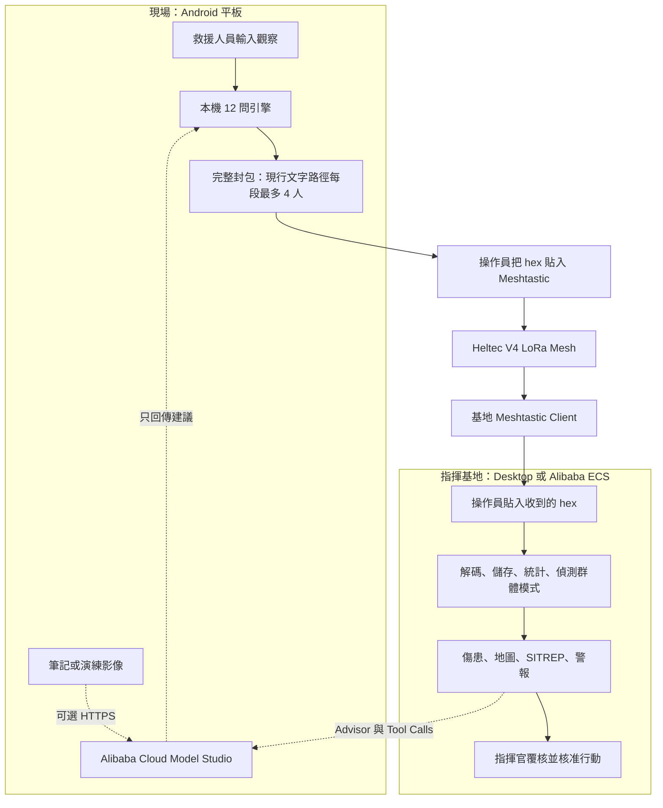
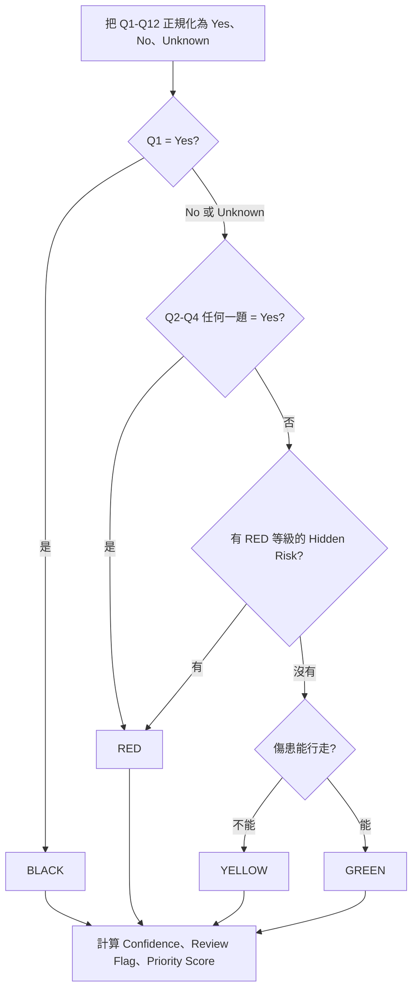
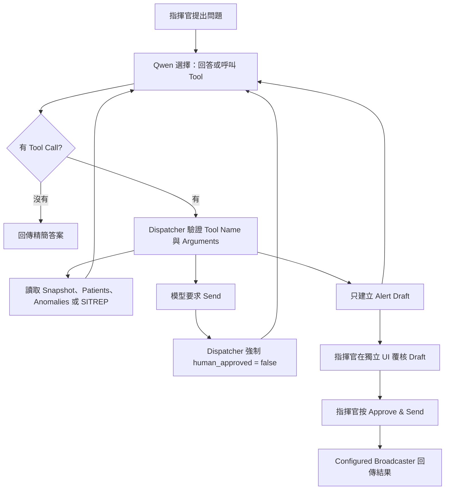
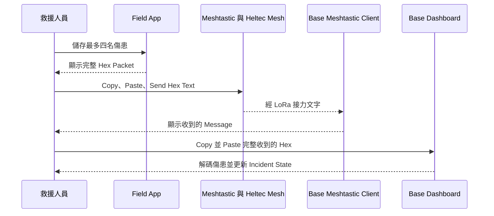
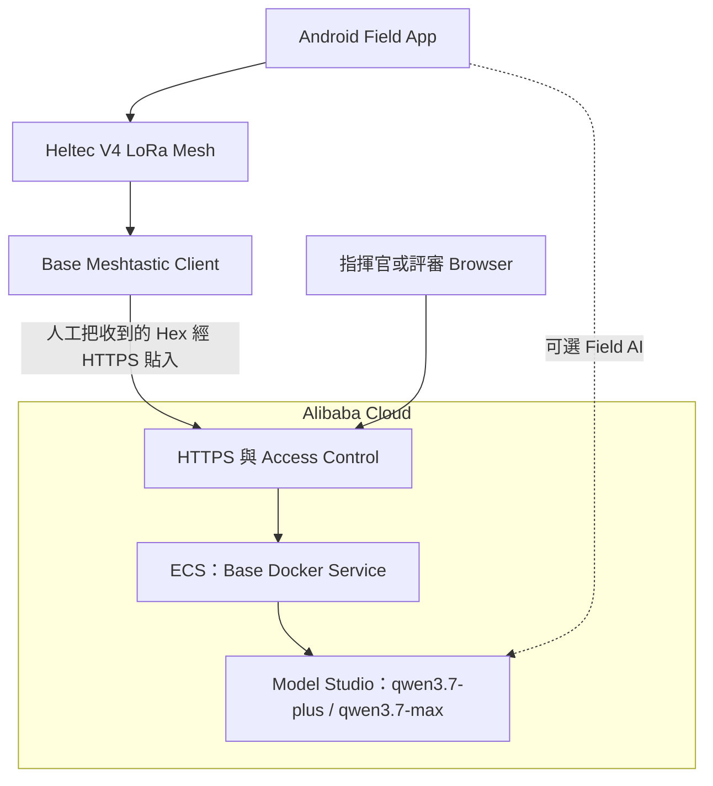

# EmergencyNet

**在流動網絡薄弱或中斷時，仍能完成現場檢傷、LoRa 網狀傳訊與指揮站協調的災難應變系統。**

[English](README.md) · [安裝指南](docs/SETUP_GUIDE.zh-TW.md) · [測試與現場示範](docs/TESTING_GUIDE.zh-TW.md) · [Alibaba Cloud 部署](docs/ALIBABA_CLOUD.zh-TW.md) · [專案故事](docs/PROJECT_STORY.zh-TW.md)

> **原型定位：**EmergencyNet 是黑客松與工程原型，不是獲認證醫療器材。臨床規則與內建指引在任何真實演練或部署前，都需要由合資格的當地醫療與事故指揮人員審核。公開示範只可使用合成資料。

## EmergencyNet 是甚麼——先用白話說清楚

救援人員在 Android 平板輸入一名傷患的狀況。平板在本機執行固定的 12 問檢查，給出 BLACK、RED、YELLOW 或 GREEN 檢傷標籤。系統同時檢查八種容易在壓力下漏掉的風險，例如面部燒傷後延遲出現的呼吸道問題，或長時間受困後可能出現的併發風險。

平板把結果轉成一個很小的封包。現行原型會把封包顯示成十六進位文字（hex）；救援人員把它複製到 Meshtastic Android App。Heltec LoRa 32 V4 透過 LoRa 網狀網絡把訊息送到指揮站。基地操作員再從 Meshtastic 複製收到的 hex，貼入 EmergencyNet Base 儀表板。

基地端（Base）儀表板會把多名傷患的資料放在一起，顯示人數、產生事故狀況報告（SITREP），並在出現群體模式時提醒指揮官。例如多名傷患都有呼吸問題，或三名傷患都被困在瓦礫之下。

Qwen Cloud 負責語言理解與資料整理：閱讀多語筆記、檢視演練影像、整理短期現場建議、總結事故狀態，以及草擬無線電短訊。Qwen **不擁有檢傷標籤**、不能把 Yes 改成 No，也不能批准自己草擬的廣播。

整個專案可以濃縮成這條流程：

```text
觀察傷患
    → 本機 12 問檢傷
    → 精簡 hex 封包
    → Meshtastic LoRa Mesh
    → 基地彙整與群體模式偵測
    → Qwen 輔助分析與草稿
    → 人作出決定
```

下文會反覆使用五個名稱，意思如下：

| 名稱 | 本文件中的意思 |
|---|---|
| 現場端（Field） | 事故現場的救援人員、Android 平板與 Radio |
| 基地端（Base） | 指揮站儀表板，通常在桌面電腦或 Alibaba ECS 主機運行 |
| 檢傷標籤（Tag） | Prototype 的優先標記：BLACK、RED、YELLOW 或 GREEN |
| SITREP | 以基地端現有全部紀錄產生的簡短事故狀況報告 |
| Mesh | 多部 Radio 互相接力，讓兩端不必直接連線 |

## 目前真的完成了甚麼

以下把已接通的功能和下一步項目分開，避免把計劃寫成現況。

| 範圍 | 現在可用 | 尚未接通／完成 |
|---|---|---|
| 現場檢傷 | Android／桌面 Gradio 表單、確定性 12 問、隱藏風險、信心值與優先分數 | 臨床驗證，以及全面阻擋互相矛盾的生命徵象輸入 |
| 現場 AI | Qwen 多語筆記、影像覆核、戰術建議整理 | 離線本機 LLM |
| 無線電 | 操作員把 hex 貼到 Meshtastic；Heltec V4 透過 LoRa Mesh 接力文字 | 現場端 App 直接發送二進位封包 |
| 基地端收訊 | 操作員把 Meshtastic 收到的 hex 貼入 **Inject test packet** | 一般示範路徑尚未自動從基地端 Radio 擷取資料 |
| 基地端作業 | 解碼、傷患表、地圖、SITREP、四種群體偵測、Qwen 顧問與工具 Agent | 持久化資料庫、防重播及去重 |
| 對外訊息 | Qwen 草稿、人工核准閘門、結果記錄 | 預設發送器是 Stub；基地端到 Radio 的真實傳送尚未接通 |
| Alibaba Cloud | Model Studio API Client、Docker Image、ECS 部署指南 | 所提供壓縮檔沒有 ECS 運行證明、公開網址、Instance ID 或 Region |

我們刻意把限制寫清楚，因為災難系統不應聲稱一項尚未完成端到端測試的能力。

## 我們要解決的問題

大量傷患事故會同時產生兩個相反的資訊問題。

在現場，一支小隊可能需要連續評估數十名傷患。明顯危殆的人會先得到注意，但外表穩定、稍後才惡化的人很容易被漏掉。救援人員同時還要記住細節、排優先次序、向基地報告，然後立即處理下一名傷患。

在指揮基地，問題正好相反。指揮官從不同小隊收到一段段短訊。單獨一宗呼吸困難可能只是個別個案；若連續五宗都出現相同問題，就可能代表煙霧、化學暴露或其他共同危險。基地需要看到整體，而不是五段互不相連的對話。

完全依賴 Internet 的系統不適合成為這項工作的唯一支柱，因此 EmergencyNet 把責任拆開：

| 設計選擇 | 背後原因 |
|---|---|
| 固定的本機檢傷規則 | 相同輸入應得到相同結果；沒有 API Key 或 Internet 時也不能消失 |
| 12 個短問題 | 固定 Checklist 可減少記憶負擔；每題兩 bits，剛好用三 bytes 放完全部答案 |
| 隱藏風險獨立處理 | 即時 START 類別訊號不能涵蓋專案內所有延遲風險 |
| AI 只能建議 No → Yes | AI 可以提醒遺漏線索，但不能抹掉已觀察到的危險，亦不能靜默降低優先度 |
| LoRa Mesh | 現場小隊不需要假設流動網路仍然正常，仍可接力小型訊息 |
| Base 群體偵測 | 真正重要的訊號有時是一群傷患的共同模式，而不是單一病歷的一句文字 |
| 廣播必須人工核准 | AI 草稿看起來合理，不代表內容正確、有需要或適合立即傳送 |
| 離線後備 | 失去 Qwen 應只失去額外分析，不應同時失去檢傷、封包、解碼與 SITREP |

## 一個具體例子

假設建築物倒塌後找到三名傷患。三人都呼吸急促、有燒傷，而且已被困 45 分鐘。

1. 救援人員在平板逐一記錄三名傷患。
2. 呼吸異常令 Q2 變成 Yes；受困至少 30 分鐘令 Q5 變成 Yes；如果有面／頸燒傷、煤灰或聲音沙啞，Q9 亦會變成 Yes。
3. 確定性引擎把三人標為 RED，並列出是哪幾條規則觸發。
4. Field App 把三個紀錄放進一段 128-character hex 訊息。
5. 操作員用 Meshtastic 送出該段文字。
6. Base 解碼三人資料，Burn Cluster 與 Crush Cluster 變成 Active。
7. 再收到兩名有呼吸問題的 RED 傷患後，RESP Cluster 與 RED Surge 亦會出現。
8. 指揮官要求 Qwen Agent 報告精確人數，並草擬一段短訊。
9. Agent 透過 Tools 讀取 Base 的即時狀態，建立 Draft，但不能送出。
10. 指揮官核對證據，再決定下一步。

這個例子已做成可直接使用的合成資料，見[測試指南](docs/TESTING_GUIDE.zh-TW.md)。

## 完整系統架構



### 誰有權決定甚麼

| 元件 | 可以做 | 不可以做 |
|---|---|---|
| 現場確定性引擎 | 推導 Q1–Q12、Tag、Risk、Confidence、Priority | 呼叫 Internet 或把最終 Tag 交給 AI |
| Qwen 現場覆核 | 讀取 Notes／Image，建議某個目前為 No 的答案改成 Yes | 把 Yes 改成 No、未經人接受便套用、直接設定 Tag |
| 現場救援人員 | 接受／拒絕建議並傳送封包 | 未經覆核便把模型建議當成最終臨床決定 |
| Base Gateway | 解碼、儲存、統計、偵測群體模式 | 用 Shadow AI 重新檢傷 |
| Qwen Strategy Advisor | 把即時事故 Snapshot 整理成發現、建議與不確定性 | 修改 Tag、發送廣播、捏造不存在的資源 |
| Qwen Tool Agent | 讀取 Base 即時狀態並建立短訊草稿 | 修改傷患資料或批准自己的 Send Request |
| 指揮官 | 核對證據並批准作業行動 | 把最終問責交給模型 |

## 現場端應用程式

Field App 是 Gradio Web App，在 Android 平板上透過 Termux／Ubuntu PRoot 運行，也可在 Laptop 作軟件測試。

救援人員輸入：

- Patient ID、Team、Zone；
- 傷患能否行走；
- 年齡估計與特殊標記；
- 呼吸類別與可選呼吸率；
- 橈動脈脈搏與精神狀態；
- 痛楚反應與可見傷勢；
- 懷孕、燒傷與受困的條件式詳細欄位；
- 可選 Notes、演練 Image 與人工 Coordinates。

App 有四個主要區域：

1. **Patient form** — 執行本機演算法、查看理由、要求 Qwen 覆核、接受／拒絕建議，再把傷患放入 Outbox。
2. **Tactical Advice** — 把本機 Care／Equipment／Transport／Safety Tables 與 Qwen 整理結果合併，顯示未來五分鐘的短建議。
3. **Outbox & Send** — 排列已儲存傷患，並建立可人工貼到 Meshtastic 的完整 Hex Packet。
4. **Settings** — 套用／測試 Model Studio Endpoint、Key 與 Model；UI 不會把 Key 寫入檔案。

## 12 問演算法

### 為甚麼是 12 題？

目的不是用問卷取代救援人員，而是在高壓下用固定步驟，把觀察轉成可重複、可檢查、能放進小型 Radio Packet 的紀錄。

前四題處理即時檢傷訊號；後八題處理較不明顯或可能延遲惡化的情況。每題答案只有 `Yes`、`No` 或 `Unknown`。封包中每題使用兩 bits，所以 12 題剛好佔 24 bits，即三 bytes。

12 是本原型的工程選擇，不代表這 12 題已構成適用全球、臨床完整的醫療規範。

### 每一題實際檢查甚麼

| Q | 白話檢查內容 | Yes 時的現行結果 | 為甚麼要問 |
|---:|---|---|---|
| Q1 | 調整呼吸道後仍沒有呼吸 | BLACK，而且最先判斷 | 這個分支必須優先於後面的 RED 條件 |
| Q2 | 呼吸率超出成人／兒童設定範圍，或呼吸急促／微弱 | RED | 呼吸異常需要即時注意 |
| Q3 | 摸不到橈動脈脈搏 | RED | 作為本原型的灌流失效訊號 |
| Q4 | 無法跟從簡單指令 | RED | 代表即時精神狀態問題 |
| Q5 | 受困至少 30 分鐘 | Hidden-Risk RED | 長時間受困者在釋放期間或之後仍可能有危險 |
| Q6 | 鈍性創傷後腹痛 | Hidden-Risk RED | 外表與初始生命徵象穩定，不代表沒有內傷 |
| Q7 | 懷孕並有腹痛、出血或胎動減少 | Hidden-Risk RED | 懷孕會改變風險與轉送安排 |
| Q8 | 創傷後新出現混亂、嗜睡或無反應 | Hidden-Risk RED | 神經狀況可能延遲惡化 |
| Q9 | 面／頸燒傷、煤灰或聲音沙啞 | Hidden-Risk RED | 呼吸道腫脹可在首次評估後變差 |
| Q10 | 有明顯傷勢但沒有痛楚 | Hidden-Risk RED | 沒有痛楚不代表傷勢輕微，需要再評估 |
| Q11 | 長者有頭部撞擊並出現混亂 | Monitoring Risk；單獨不強制 RED | 初期穩定仍可能需要反覆神經觀察 |
| Q12 | 近距離爆炸暴露，但目前看來正常 | Hidden-Risk RED | Blast-related 呼吸問題可能稍後才出現 |

以上是對軟件規則的解釋。醫療 Threshold、Timeline 與內建 Action Text 仍屬原型內容，需要合資格人士審核。

### Tag 的判斷次序



次序非常重要。Q1 會在考慮 RED 警號之前直接回傳 BLACK。若 Q1 不是 Yes，引擎會繼續判斷；Q1 為 Unknown 時亦會降低信心值並要求人工覆核。之後只要 Q2–Q4 有一題是 Yes，或出現 RED 級別的隱藏風險，結果就是 RED。沒有以上條件，才會以能否行走區分 YELLOW 與 GREEN。

### Confidence 與 Human Review Flag

目前信心值公式是：

```text
confidence = 1 −（Unknown 答案數 ÷ 12）
```

如果 Q1、Q5、Q6、Q7 或 Q9 是 Unknown，Confidence 上限會變成 `0.4`，而且紀錄會要求人工覆核。Confidence 低於 `0.6` 亦會要求覆核。

這裡有一項尚未解決的 Validation 問題：Q2／Q3 是 Unknown 時，目前不保證觸發 Review Flag；`breathing=normal` 同時輸入 `RR=0` 這類矛盾資料亦未被 Hard-Block。我們沒有擅自修改臨床政策，而是公開問題，讓合資格 Owner 決定應拒絕輸入、強制覆核，還是改變 Tag 行為。

### Priority Score

Tag 才是主要判斷。另一個確定性分數只用來在同一個操作畫面排序。它以 Tag 分數開始，再按 Hidden Risk、同時出現的呼吸／灌流問題、Airway Concern 與 Special Population 加分；Safety-Critical Unknown 會扣分。這是排序工具，不是第二次診斷。

## 八種隱藏風險

即時檢傷問的是：「誰現在最需要處理？」Hidden-Risk Layer 問的是另一件事：「誰現在看起來沒那麼嚴重，但有理由稍後惡化，或需要不同資源？」

我們刻意把兩者分開。如果全部混在一個無法解釋的模型結果中，救援人員只會看到「AI 說 RED」，卻不知道為甚麼。EmergencyNet 會顯示觸發的 Question、Risk Name、現行等級、原因及原型 Action Text。

| 題目 | Code 內的 Risk 名稱 | 現行等級 | 軟件想避免的遺漏 |
|---|---|---|---|
| Q5 | Crush release syndrome | `RED_WITHIN_HOUR` | 忽略長時間受困者在釋放後的風險 |
| Q6 | Occult internal haemorrhage | `RED_WITHIN_HOUR` | 因為初步生命徵象穩定，就假設沒有內傷 |
| Q7 | Placental abruption | `RED_NOW` | 把懷孕創傷當成一般輕傷處理 |
| Q8 | Progressive neurological deterioration | `RED_WITHIN_HOUR` | 忽略在清醒期後變差的頭部／神經狀況 |
| Q9 | Delayed airway obstruction | `RED_WITHIN_HOUR` | 等到呼吸道腫脹已很明顯才注意 |
| Q10 | Neurogenic shock / spinal-cord injury | `RED_WITHIN_HOUR` | 把「不痛」錯當成「傷勢不嚴重」 |
| Q11 | Older-adult subdural haematoma | `MONITORING_REQUIRED` | 太早停止留意長者頭部創傷 |
| Q12 | Primary blast-lung injury | `RED_WITHIN_HOUR` | 因為症狀延遲，就假設爆炸暴露者安全 |

## Qwen 用在哪裡，以及為甚麼

EmergencyNet 沒有把每個決定都交給同一個大模型。每項 AI 功能只有一個清楚任務，也有明確失敗行為。

| 功能 | 輸入 | 輸出 | Model | AI 的用途 | 硬性限制 |
|---|---|---|---|---|---|
| Notes Review | Free Text + 目前 Q1–Q12 | 帶理由的 No → Yes 候選變更 | `qwen3.7-plus` | 救援人員可能把重要線索寫在固定欄位之外 | Parser 丟棄降級及對 Yes／Unknown 的修改；必須由人接受 |
| Multilingual Review | 救援人員語言的 Notes | English Rendering + 相同安全候選變更 | `qwen3.7-plus` | 同一模型可直接理解筆記，不增加獨立 Translation Hop | 不使用 Separate Translation Model；套用相同 No → Yes Filter |
| Exercise-Image Review | 演練影像 + Form Summary | Visual Findings + 候選變更 | `qwen3.7-plus` | 提醒 Form 可能漏掉的可見線索 | 只可用演練／合成 Image；Image 不進 LoRa Packet；人決定是否接受 |
| Field Tactical Advice | Tag、Risk、Environment、Visible Injury、本機 Tables | 五分鐘建議、Equipment、Transport、PPE、Perimeter | `qwen3.7-plus` | 把多張固定 Tables 整理成短操作視圖 | Equipment Whitelist；不可降低 Transport；PPE／Perimeter 不得低於 Baseline；離線有 Table Fallback |
| Base Strategy Advisor | 精確 Live Snapshot + Commander Question | Summary、Findings、Actions、Watch Items、Uncertainty | `qwen3.7-max` + Thinking | 把多名傷患整理成指揮層答案 | 不可改 Tag 或 Send；必須說明缺失資料；有 Structured JSON Repair／Fallback |
| Base Tool Agent | Commander Request | Tool Result、精確人數、SITREP、短訊草稿 | `qwen3.7-plus` | 從程式即時狀態讀資料，而不是依 Chat History 猜測 | 最多六步、沒有改 Tag Tool、模型提供的 Approval 一律被覆寫 |

### 為甚麼確定性規則不能放進模型

模型每次輸出可能不同，網路呼叫可能失敗，多語筆記也可能有歧義。檢傷需要可追查，而且 Cloud 消失時仍存在。因此 Qwen 只在固定核心周圍補充證據與整理資訊，不取代核心。

### 為甚麼 AI 可以提高風險，卻不能降低風險

如果結構化資料已表示危險存在，模型不應因為一句筆記或影像判讀便把它抹掉。Review Parser 只保留「目前答案是 No，而且目標是 Yes」的建議。即使如此，建議仍保持 Pending，直至救援人員選擇 qkey，再按 **Apply accepted escalations & re-evaluate**。

這是一個保守的 Software Boundary，不代表每一項 AI 升級都必然符合醫療判斷。

## Base Tool Agent Loop 怎樣運作

Base Agent 不是一個只讀過 README 的自由聊天機器人。它用 Function Calling 讀取程式的即時狀態。

共有六個 Tools：

| Tool | 回傳或改動甚麼 |
|---|---|
| `get_situation_snapshot` | Patient Count、Tag Count、Hidden-Risk Count、Active Anomaly、Draft Count |
| `list_patients` | 最多 50 名最近傷患的 ID、Tag、Risk、Injury、Age |
| `list_anomalies` | 現行確定性 Anomaly Detector 結果 |
| `build_sitrep_md` | 確定性 Markdown SITREP |
| `draft_mesh_alert` | 儲存 Severity、Anomaly Type、最多 180 Characters 的 Draft；不會傳送 |
| `request_send_broadcast` | 提出 Send Request，但需要與模型分開的人類核准來源 |



實際步驟：

1. Commander Request 與固定 System Rules 送到 `qwen3.7-plus`。
2. Qwen 回傳文字，或要求呼叫一個／多個已知 Tools。
3. Dispatcher 拒絕未知 Tool，並 Parse／限制 Arguments。
4. Tool Result 加回 Conversation，下一個模型步驟可使用精確 Live Data。
5. Qwen 回傳 Final Answer 或到達六個 Model Steps 時，Loop 結束。
6. 如果 Qwen 建立 Draft，Draft 會有獨立 ID，而且 `sent=false`。
7. 如果 Qwen 偽造 `human_approved=true`，Dispatcher 會覆寫成 `false`，回傳 `human_approval_required`。
8. 只有獨立 Dashboard Button 能在真人 Click 後，以 Approved 狀態呼叫 Send Function。

預設 Broadcaster 目前只回傳 Demo Stub Result。因此 UI 可證明 Approval Gate 有效，但不能證明 Base 真正透過 Radio 送出訊息。

### 為甚麼用 Tools，而不是叫 Qwen「看看現場狀況」？

一段文字 Prompt 可能過期或缺資料。Tools 讓模型按需要取得最新人數，並把每次呼叫保留在 Audit List。權限亦變得具體：根本沒有修改 Tag 的 Tool，而 Drafting 與 Sending 是兩個不同操作。

## Radio Mesh 與封包設計

### 為甚麼用 LoRa Mesh？

LoRa 可在不依賴一般流動網路的情況下傳送小型 Radio Message。Meshtastic 提供 Node-to-Node Relay；兩個 Endpoint 無法直接通訊時，訊息可經另一塊 Heltec 接力。

EmergencyNet 目前沒有聲稱任何實測 Range 或 Reliability。結果會受合法 Frequency Region、Antenna、Modem Preset、Terrain、Node Placement 與實際測試紀錄影響。

### 現行人工路徑



原型為甚麼用 Hex？因為現有 Meshtastic Text App 已可顯示、複製與檢查 Hex，Radio Demo 不需要依賴未完成的 Android-to-Radio 自訂 Bridge。代價是資料變大：一個 Binary Byte 會變成兩個文字 Characters。

### Packet Layout

每個 Packet 有 10-byte Header；每名傷患使用 18 bytes。

| 部分 | Bytes | 內容 |
|---|---:|---|
| Header | 10 | Version、Team ID、Timestamp、Patient Count、Zone、XOR Checksum |
| 傷患身分／位置 | 7 | One-byte Patient ID、Fixed-Point Latitude／Longitude |
| Tag／Confidence | 1 | Two-bit Tag、Six-bit Confidence |
| 12 個答案 | 3 | 12 個 Two-bit Yes／No／Unknown |
| Risk／Walking Flags | 1 | Q5–Q11 Flags + Ambulatory Bit；Q12 從 Answer Bits 重建 |
| 精簡觀察 | 5 | Age、Injury、Special Marker、Breathing、Pulse、Mental、Pain、Review Flag、Entrapment Time |
| Patient Checksum | 1 | 前 17 個 Patient Bytes 的 XOR |

Binary Codec 支援 12 人：

```text
10-byte Header +（12 × 18-byte Patient）= 226 bytes
```

現行文字路徑不同，因為 Hex 會把長度加倍：

| 傷患數 | Binary Bytes | Hex Text Characters | 現行 Demo 用法 |
|---:|---:|---:|---|
| 1 | 28 | 56 | 安全 |
| 3 | 64 | 128 | 安全 |
| 4 | 82 | 164 | 預設上限 |
| 5 | 100 | 200 | 沒有餘量；避免使用 |
| 12 | 226 | 452 | 無法放進一段一般 Meshtastic Text Message |

因此 Field UI 每段最多輸出四人，剩下傷患留在 Outbox，下一次建立另一個完整 Packet。系統不會從中間切開一個 Packet。

XOR 可偵測意外損壞，但不是 Signature 或 Message Authentication Code。真實部署仍需要 Sender Authentication、Replay Protection 與 Key Management。

## 資料到達 Base 後會發生甚麼

操作員 Inject 收到的 Packet 後，Base Gateway 會：

1. 檢查 Header 與 Patient Checksum；
2. 安全拒絕 Malformed、Truncated、Concatenated 或 Wrong-Version Packet；
3. 解碼 Patient Record；
4. 在記憶體保存最多 500 名最近傷患；
5. 更新 Zone Count 與 30-Patient Anomaly Window；
6. 建立 Patients／SITREP View，並執行四種 Pattern Detector；
7. 按需要要求 Qwen 整理 Live Snapshot 或建立 Draft。

### 群體模式偵測

| Alert | 現行 Trigger | Base 為甚麼要檢查 |
|---|---|---|
| `RESP_CLUSTER` | 至少 5 人，而且至少 50% 呼吸急促／微弱或無呼吸 | 多宗呼吸問題可能代表共同的 Airborne、Smoke 或 Chemical Hazard，值得調查 |
| `BURN_CLUSTER` | 至少 3 人，而且至少 60% 有 Burn Injury | Burn Pattern 可能改變資源、Scene Safety 與 Transport 需求 |
| `CRUSH_CLUSTER` | 至少 3 人標記為 Entrapped | 多名受困者可能需要 Structural Rescue 協調 |
| `RED_SURGE` | 10 分鐘內至少 5 個 RED Record | Critical Patient 突然增加，可能需要升級 Incident Response |

以上 Threshold 是目前可設定的原型預設值，不是經驗證的全球通用 Emergency Threshold。Alert 不會修改任何 Individual Tag。

### Base Dashboard 畫面

- **SITREP** — 以確定性方式總結 Tag、Zone 與 Alert。
- **Patients** — 最近解碼的 Patient Record。
- **Agent / Drafts** — 讀取 Live State 的 Tool Agent 與已儲存 Alert Draft。
- **Advisor** — `qwen3.7-max` Strategy Response，包含明確 Uncertainty。
- **Inject test packet** — 現行人工 Meshtastic Receive Boundary。
- **Map** — 已解碼 Patient Coordinates，加上可選 Position／Civilian Source。
- **Civilian intake** — 保留的可選 JSON Intake，供另一個 App；不是 EdgeAgent 核心 Demo 必需。
- **Broadcasts / Compose Broadcast** — AI 草稿流程與人工核准控制。
- **Settings** — Model Studio Connection 與 Model。

## 沒有 Internet 或 API Key 時，哪些功能仍可用

| 功能 | Qwen 可用 | Qwen 不可用 |
|---|---|---|
| Q1–Q12、Tag、Risk、Confidence、Priority | 本機結果 | 完全相同的本機結果 |
| Packet Creation 與人工 LoRa Relay | 可用 | 可用 |
| Base Decode、Patient Table、Detector、SITREP | 可用 | 可用 |
| Multilingual／Vision Review | 有 Suggestions | Button 顯示不可用；不會靜默修改資料 |
| Tactical Advice | Qwen 整理 + 固定 Tables | 固定 Table-Based Fallback |
| Base Strategy／Tool Agent | 可用 | 受控 Unavailable／Fallback Response |

原因很簡單：更好的解釋很有用，但解釋消失時，基本工作流程不能一起消失。

## Alibaba Cloud Backend

比賽提交版本應把 Base Docker Service 部署到 Alibaba Cloud ECS，並透過 Alibaba Cloud Model Studio 使用 Qwen。



Code Proof：

- [`emergencynet/qwen_client.py`](emergencynet/qwen_client.py) 實作 Model Studio OpenAI-Compatible Chat、Vision、JSON、Thinking 與 Tool Calls。
- [`emergencynet/ai_config.py`](emergencynet/ai_config.py) 綁定 Endpoint、API Key 與 Model Roles。

Runtime Proof 是另一項要求。所提供專案**沒有** ECS Instance ID、Region、Public URL 或 Proof Capture。先完成 [Alibaba Cloud 部署與證據指南](docs/ALIBABA_CLOUD.zh-TW.md)，再替換：

- Repository：`https://github.com/<OWNER>/<REPO>`
- Direct Code Proof：`https://github.com/<OWNER>/<REPO>/blob/main/emergencynet/qwen_client.py`
- Judge URL：`https://<YOUR-DEMO-HOST>`
- Runtime Proof：`<PUBLIC-PROOF-URL>`

Laptop 呼叫 Qwen 可以證明使用 Model Studio API，但不能證明 Backend 本身正在 Alibaba Cloud 運行。

## 快速軟件運行

建議 Python 3.11。

```bash
python3 -m venv .venv
source .venv/bin/activate
python -m pip install -r requirements.txt
cp .env.example .env
python -m emergencynet.gradio_app
```

第二個 Terminal：

```bash
source .venv/bin/activate
python -m emergencynet.base_dashboard
```

- Field：`http://127.0.0.1:7860`
- Base：`http://127.0.0.1:7861`

Windows Command Prompt／PowerShell、Linux、macOS、Android Termux + Ubuntu PRoot、Heltec V4 刷機、Meshtastic Private Channel 與 Docker 步驟，全部在[完整安裝指南](docs/SETUP_GUIDE.zh-TW.md)。

可選 Qwen 設定：

```dotenv
DASHSCOPE_API_KEY=replace_me
QWEN_BASE_URL=https://dashscope-intl.aliyuncs.com/compatible-mode/v1
QWEN_MODEL_FIELD=qwen3.7-plus
QWEN_MODEL_VISION=qwen3.7-plus
QWEN_MODEL_STRATEGY=qwen3.7-max
QWEN_MODEL_AGENT=qwen3.7-plus
```

不要 Commit `.env`，也不要在 Screenshot、Video、Log 或 Browser-Side Source 暴露 Key。

## Docker

```bash
docker compose up --build
```

- Field：`http://localhost:7860`
- Base：`http://localhost:7861`

Docker 供 Desktop／Server 使用，不是一般未 Root Android Tablet 的路徑。詳見 [Docker 指南](docs/DOCKER.zh-TW.md)。

## 測試與 Live Demo 資料

```bash
python -m pip install -r requirements-dev.txt
python -m pytest -q
```

Repository 內有雙語合成 Fixture，可測試：

- 一個 Packet 顯示全部四種 Tag；
- 兩個 Packet 觸發全部四種 Aggregate Alert；
- 多語 Hidden-Clue Review；
- Prompt Injection 嘗試降低 Tag；
- 模型偽造 Human Approval；
- Invalid Hex、Checksum Corruption、Truncation、Concatenation；
- Qwen Offline Fallback。

先看[測試與三分鐘 Demo 指南](docs/TESTING_GUIDE.zh-TW.md)。精確 Machine-Readable Data 位於：

- [`demo_data/demo_packets.zh-TW.json`](demo_data/demo_packets.zh-TW.json)
- [`demo_data/demo_scenarios.zh-TW.json`](demo_data/demo_scenarios.zh-TW.json)
- 對應 English `.en.json`。

## 我們怎樣建造，以及為甚麼必須按這個次序

1. **先研究救援人員的工作負擔，而不是先做 Chatbot。** 加入 Qwen 前，整個流程必須在斷網時仍然合理。
2. **把 12 問 Function 設為唯一 Tag Authority。** 每個結果都有可見理由，Unit Test 才真正有意義。
3. **把 Hidden Risk 寫成明確規則。** 我們希望救援人員看到遺漏了甚麼，而不是收到一句無法解釋的「AI 說 RED」。
4. **先按受限 Radio 設計 Packet。** Wire Format 只保留 Base 排優先次序與找出群體模式所需資料。
5. **量度真實 Text Path。** 226-byte Binary Packet 變成 452 個 Hex Characters，因此 UI 改為四人 Packet，而不是假裝 12 人能放進一段 Message。
6. **先做 Base Aggregation，再做 Agent。** Agent 必須有可信 Live State，否則只是在產生看似合理的文字。
7. **把 Advice、Draft、Send 分開。** Model 可以幫忙寫訊息，但另一層 Permission Boundary 才控制 External Action。
8. **主動測試模型嘗試越過邊界。** 真正把 Model Approval 變成 False 的是 Dispatcher，不是 Prompt 裏的一句要求。

最大的學習是：可靠性不是 AI 失敗後才補上的功能；它是令 AI 有資格被使用的整個結構。

## 已知限制

- 現行 Field-to-Base Patient Transport 有兩次人工 Copy／Paste。
- Direct Binary Meshtastic TX 與 Automatic Base Ingestion 尚未接入正常 Demo Path。
- Base 預設 Outbound Broadcaster 是 Stub；UI Success 不是 RF Delivery Proof。
- Base Store 在記憶體，重播相同 Packet 會當成新紀錄。
- XOR 只偵測意外損壞，不能驗證 Sender Identity。
- Patient ID 只用一 byte；目前 Wire Format 在沒有更大 Incident Namespace 下支援 `0–255`。
- Heltec V4 提供 GNSS Interface，但本身不等於已整合 Location Fix；Form 接受人工 GPS。
- 互相矛盾或無效的 Primary Vital Input 未完全 Hard-Block；Q2／Q3 Unknown 目前不保證出現 Review Flag。
- Aggregate Threshold 與 Clinical Rule 是原型預設值，需要 Domain Review。
- Range、Latency、Packet Loss、Field Reliability、Clinical Performance、Lives Saved 都未量度，不能捏造數字。
- 所提供 Archive 不能證明已有 Live Alibaba ECS Deployment。

## 為甚麼這是 EdgeAgent 專案

EmergencyNet 把 Physical Edge、Cloud Reasoning 與 Local Action 接在一起，但不假設 Cloud 永遠在線：

| EdgeAgent 部分 | EmergencyNet 實作 |
|---|---|
| Physical Edge | Android Tablet + Heltec LoRa 32 V4 |
| Perception | Structured Observation、Notes、Staged Image、Manual Coordinates |
| Local Reasoning／Action | Deterministic Triage、Risk Check、Priority、Packet Creation |
| Cloud Reasoning | Qwen Notes／Vision Review、Tactical Synthesis、Strategy、Function-Calling Agent |
| Constrained Communication | 精簡 Patient Record 經 Meshtastic LoRa Mesh 傳送 |
| Graceful Failure | 沒有 Qwen 時，Field／Base 核心流程仍運作 |
| Human Control | 人接受 AI Escalation，並核准 External Message |

競賽資料與 Submission Checklist 在[競賽脈絡](docs/COMPETITION_CONTEXT.zh-TW.md)。提交前必須再次檢查[官方頁](https://qwencloud-hackathon.devpost.com/)與[正式規則](https://qwencloud-hackathon.devpost.com/rules)。

## Repository Map

```text
emergencynet/
  screening.py              Form → Q1-Q12
  triage_core.py            Tag、Confidence、Review、Priority
  risk_engine.py            八種 Hidden-Risk Rules
  bit_packer.py             10-byte Header／18-byte Patient Codec
  gradio_app.py             Field UI 與四人 Manual Relay
  gateway.py                Base Decode 與 Bounded Patient Store
  anomaly_detector.py       四種 Aggregate Pattern Detector
  sitrep_generator.py       Deterministic Incident Summary
  multilingual.py           Direct Multilingual Safe Escalation
  multimodal.py             Staged-Image Safe Escalation
  field_ai.py               Field Tactical Synthesis 與 Fallback
  strategy_ai.py            qwen3.7-max Live-Snapshot Advisor
  base_agent.py             六工具 Qwen Agent 與 Approval Block
  base_dashboard.py         Base UI
  qwen_client.py            Model Studio API Transport

data/field_tables/           Offline Tactical Lookup Tables
demo_data/                  雙語 Synthetic Packets 與 Scenarios
tests/                      Deterministic 與 Mocked-Qwen Tests
docs/                       Setup、Operation、Cloud、Story、Audit Guides
```

## 文件

- [Android、Heltec V4、Meshtastic、Desktop、Docker 完整安裝](docs/SETUP_GUIDE.zh-TW.md)
- [端到端測試與三分鐘 Live Demo](docs/TESTING_GUIDE.zh-TW.md)
- [操作手冊](docs/MANUAL.zh-TW.md)
- [Alibaba Cloud 部署與證明](docs/ALIBABA_CLOUD.zh-TW.md)
- [Pitch 與 Project Story](docs/PROJECT_STORY.zh-TW.md)
- [詳細技術架構](docs/ARCHITECTURE.zh-TW.md)
- [文件品質審查](docs/DOCUMENTATION_REVIEW.zh-TW.md)

所有公開操作文件都有 Traditional Chinese 與 English 版本。

## License

Apache License 2.0，見 [LICENSE](LICENSE)。提交前亦要確保 Public Repository 的 **About** 區顯示偵測到的 License。
