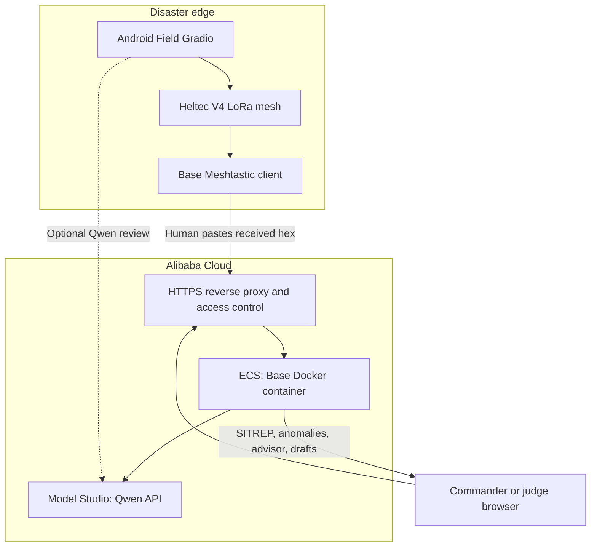

# Alibaba Cloud deployment and competition proof

[繁體中文](ALIBABA_CLOUD.zh-TW.md) · [Architecture](ARCHITECTURE.md) · [Official Qwen competition](https://qwencloud-hackathon.devpost.com/)

> **Current evidence status:** the repository contains the Alibaba Cloud Model Studio client and a deployable Base container. No ECS instance ID, region, public URL, or runtime evidence was present in the supplied archive. Complete this guide and replace every placeholder before claiming that the backend is running on Alibaba Cloud.

## 1. What the requirement means

The official competition overview currently says:

- the backend must be running on Alibaba Cloud; and
- proof must include a link to a code file in the repository that demonstrates use of Alibaba Cloud services/APIs.

For EmergencyNet, satisfy both—not only one:

1. **Runtime:** deploy the Base dashboard/backend Docker container on an Alibaba Cloud ECS instance.
2. **Code:** link directly to `emergencynet/qwen_client.py`, which calls Alibaba Cloud Model Studio's DashScope OpenAI-compatible API; also point to `ai_config.py` for endpoint/model binding.

A call from a local laptop to Qwen Cloud proves API use but does not by itself prove that the backend runs on Alibaba Cloud.

## 2. Deployed structure



Data boundaries:

- Structured compact patient data reaches ECS only after the current human copy/paste step.
- Images used by Field vision review go to Model Studio over HTTPS and are not packed into LoRa messages.
- The Base store is in memory; container restart clears it.
- Use synthetic data in the public judge deployment.

## 3. Code proof

Use a direct GitHub blob URL, not a repository home page:

```text
https://github.com/<OWNER>/<REPO>/blob/main/emergencynet/qwen_client.py
```

That file demonstrates:

- OpenAI-compatible HTTPS requests;
- `Authorization: Bearer ...` for the Model Studio key;
- `/chat/completions` requests;
- text, vision, JSON, thinking, and function-calling response handling;
- timeouts and controlled error responses.

Supporting configuration:

```text
https://github.com/<OWNER>/<REPO>/blob/main/emergencynet/ai_config.py
```

The current international endpoint is:

```text
https://dashscope-intl.aliyuncs.com/compatible-mode/v1
```

Model availability depends on the Model Studio deployment scope. The repository defaults are `qwen3.7-plus` for Field/vision/agent and `qwen3.7-max` for Strategy.

## 4. Deploy Base to Alibaba Cloud ECS

### Create the instance

1. In the Alibaba Cloud ECS console, create a small Linux ECS instance in the region closest to judges and compatible with the chosen Model Studio service scope.
2. Assign a public IPv4 address or Elastic IP.
3. Use a supported x86_64 Linux image with enough RAM for Gradio and Docker. The application does not load local LLM weights.
4. Add an SSH key; do not use a weak password.
5. Record, but do not publish secrets: instance ID, region, image, public IP, and creation time.

### Security group

Use least privilege:

| Port | Source | Purpose |
|---:|---|---|
| 22/TCP | Your fixed admin IP/CIDR only | SSH |
| 80/TCP | Public temporarily | ACME redirect/challenge, if used |
| 443/TCP | Public or judge network | HTTPS demo |
| 7861/TCP | Do not expose publicly | Base behind reverse proxy |

Alibaba Cloud recommends restricting management ports such as SSH rather than opening them to `0.0.0.0/0`. See [ECS security group guidance](https://www.alibabacloud.com/help/en/ecs/user-guide/start-using-security-groups).

### Install Docker

Follow Alibaba Cloud's current distro-specific [Install and use Docker on ECS](https://www.alibabacloud.com/help/en/ecs/user-guide/install-and-use-docker) guide. Verify:

```bash
docker --version
docker compose version
```

### Obtain and configure the project

```bash
git clone https://github.com/<OWNER>/<REPO>.git emergencynet
cd emergencynet
cp .env.example .env
chmod 600 .env
nano .env
```

Set only server-side values:

```dotenv
DASHSCOPE_API_KEY=replace_with_real_secret
QWEN_BASE_URL=https://dashscope-intl.aliyuncs.com/compatible-mode/v1
QWEN_MODEL_STRATEGY=qwen3.7-max
QWEN_MODEL_AGENT=qwen3.7-plus
QWEN_AGENT_MAX_STEPS=6
BASE_GRADIO_HOST=0.0.0.0
BASE_GRADIO_PORT=7861
```

Do not commit `.env`, print it, or record it on screen.

### Build and start Base only

```bash
docker compose build base
docker compose up -d base
docker compose ps
docker compose logs --tail=100 base
curl -I http://127.0.0.1:7861
```

Expected:

- `emergencynet-base` is running.
- Logs show the Qwen endpoint/model and `has_key=True` without displaying the key.
- Local HTTP returns a Gradio response.

### Add HTTPS and access control

The application itself has no production authentication. Do not open port 7861 to the world. Place it behind Alibaba Cloud ALB/SLB with TLS and authentication, or a host reverse proxy.

One conventional host pattern is Nginx + Basic Auth + a valid TLS certificate. The essential WebSocket-aware location is:

```nginx
server {
    listen 443 ssl;
    server_name <YOUR-DEMO-HOST>;

    ssl_certificate     <FULLCHAIN_PATH>;
    ssl_certificate_key <PRIVATE_KEY_PATH>;

    auth_basic "EmergencyNet judge demo";
    auth_basic_user_file /etc/nginx/.htpasswd;

    location / {
        proxy_pass http://127.0.0.1:7861;
        proxy_http_version 1.1;
        proxy_set_header Host $host;
        proxy_set_header X-Forwarded-Proto $scheme;
        proxy_set_header X-Forwarded-For $proxy_add_x_forwarded_for;
        proxy_set_header Upgrade $http_upgrade;
        proxy_set_header Connection "upgrade";
        proxy_read_timeout 300s;
    }
}
```

Obtain a certificate through your approved domain/certificate workflow. Provide judge credentials privately in Devpost, not in the public repository. Keep only synthetic data on this instance.

## 5. Runtime verification

From a clean browser outside the ECS network:

1. Open `https://<YOUR-DEMO-HOST>` and authenticate.
2. In **Inject test packet**, paste Packet A then Packet B from the testing guide.
3. Confirm five RED patients and all four anomaly types.
4. Open **Settings**, run a Qwen connection check if available.
5. In **Agent / Drafts**, ask the tool agent to inspect live state and create a draft.
6. In **Advisor**, request a ten-minute plan.
7. Verify logs on ECS while making the requests:

```bash
docker compose logs --since=10m base
```

8. Remove the API key temporarily only in a controlled test, restart, and confirm deterministic ingest/SITREP still works; restore it afterward.

Never use a screenshot of a successful local run as ECS runtime proof.

## 6. Proof capture: 45–60 seconds

Record a short, separate proof clip or an unambiguous segment in the main video:

| Time | Capture | Redaction |
|---|---|---|
| 0–10 s | Alibaba Cloud ECS console showing instance ID suffix, region, Running | Hide account ID, public billing data |
| 10–20 s | SSH/Workbench: `hostname`, `docker compose ps` | Do not show shell history with secrets |
| 20–35 s | Public HTTPS Base URL; inject a prepared packet | Use synthetic packet only |
| 35–50 s | Advisor/Agent request returns; ECS container logs update | Hide Authorization headers/API key |
| 50–60 s | Browser opens the exact public GitHub `qwen_client.py` link | Ensure repository is public |

Also capture a still image of the architecture diagram. Keep the proof URL public or accessible under the competition's judging rules.

## 7. Copy-ready Devpost description

Replace every bracketed field with verified facts:

> **Alibaba Cloud deployment proof**  
> EmergencyNet's Base dashboard/backend runs as a Docker container on an Alibaba Cloud ECS instance in **[REGION]**. The deployed Base accepts compact field packet hex through its authenticated HTTPS interface, decodes and aggregates synthetic patient records, detects incident-level patterns, and invokes Alibaba Cloud Model Studio for the Qwen strategy advisor and function-calling agent. The Model Studio integration uses the international DashScope OpenAI-compatible endpoint; implementation: **[DIRECT LINK TO `emergencynet/qwen_client.py`]**. Supporting model/endpoint configuration: **[DIRECT LINK TO `emergencynet/ai_config.py`]**. Live judge URL: **[HTTPS URL]**. Runtime proof: **[PUBLIC VIDEO/IMAGE URL]**. The API key is stored only in the ECS server environment and is not committed or exposed to browsers.

Short version:

> Backend: Alibaba Cloud ECS **[INSTANCE/REGION]** running the Base Docker service. AI: Alibaba Cloud Model Studio (`qwen3.7-plus`, `qwen3.7-max`) through DashScope's OpenAI-compatible API. Code proof: **[LINK]**. Runtime proof: **[LINK]**. Judge demo: **[LINK + PRIVATE CREDENTIALS IN DEVPOST]**.

## 8. Evidence checklist

- [ ] Real ECS instance ID and region recorded.
- [ ] Base container running on that instance.
- [ ] Security group exposes 443, not public 7861; SSH restricted.
- [ ] Valid HTTPS and judge access credentials.
- [ ] Public demo tested from a clean external browser.
- [ ] `qwen_client.py` direct public URL works without GitHub login.
- [ ] One live Model Studio-backed Advisor or Agent result captured.
- [ ] ECS logs shown without the key.
- [ ] Runtime proof URL is public/accessible to judges.
- [ ] README and Devpost placeholders replaced.
- [ ] Claims say Base outbound radio is a stub unless it has actually been wired and RF-tested.

## 9. Operations and limitations

- Use `docker compose pull` only if using a registry; this repository builds locally by default.
- Rebuild after a code update: `git pull`, `docker compose build base`, `docker compose up -d base`.
- Preserve the old container/image until the new health check passes; do not update immediately before a live demo without rollback time.
- The current in-memory store is not durable. A restart resets incident data and anomaly windows.
- There is no built-in user management, database, audit-log persistence, deduplication, or healthcare compliance certification.
- Qwen usage incurs quota/cost and depends on the selected Model Studio scope.

## Official references

- [Competition requirements](https://qwencloud-hackathon.devpost.com/)
- [Model Studio OpenAI-compatible Chat](https://www.alibabacloud.com/help/en/model-studio/compatibility-of-openai-with-dashscope)
- [Model Studio model selection](https://www.alibabacloud.com/help/en/model-studio/text-generation-model)
- [Model Studio deep thinking](https://www.alibabacloud.com/help/en/model-studio/deep-thinking)
- [ECS Docker installation](https://www.alibabacloud.com/help/en/ecs/user-guide/install-and-use-docker)
- [ECS security groups](https://www.alibabacloud.com/help/en/ecs/user-guide/security-group-rules)
