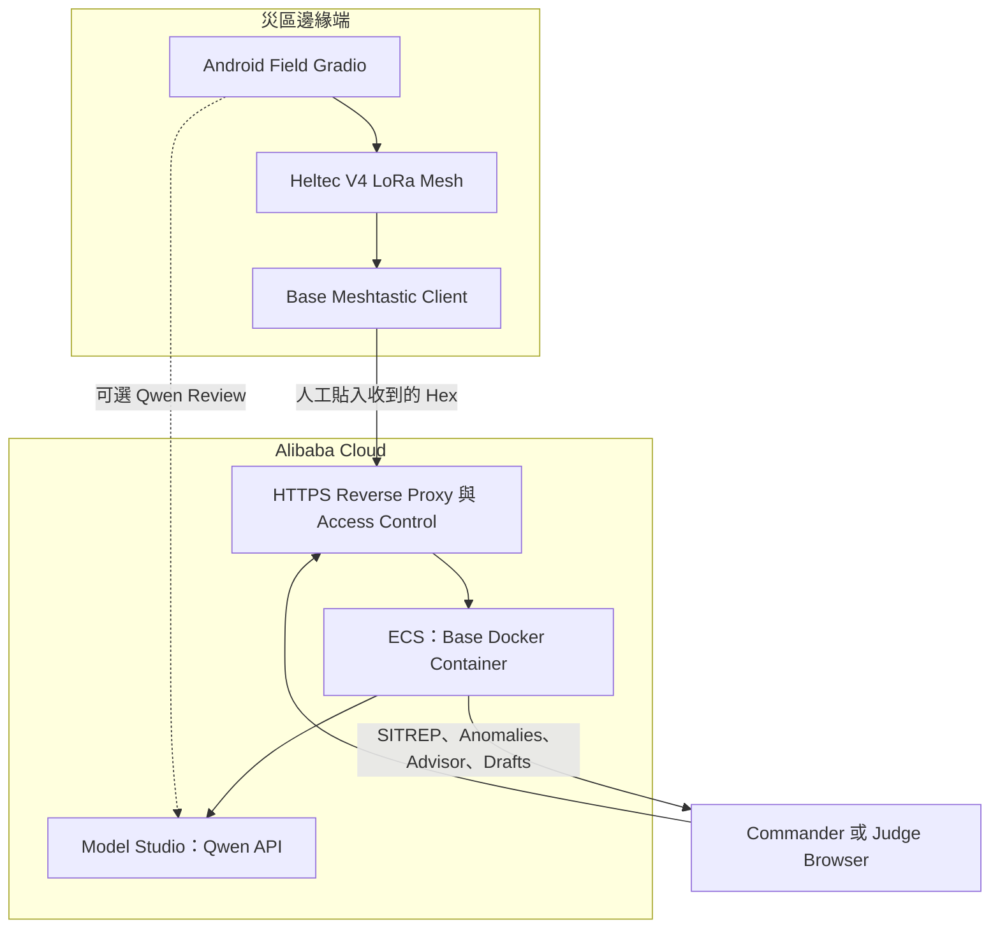

# Alibaba Cloud 部署與競賽證明

[English](ALIBABA_CLOUD.md) · [系統架構](ARCHITECTURE.zh-TW.md) · [Qwen 競賽官方頁](https://qwencloud-hackathon.devpost.com/)


## 1. Requirement 的實際意思

官方 Competition Overview 目前要求：

- Backend 必須在 Alibaba Cloud 運行；以及
- Proof 必須包含連到 Repository 內、展示 Alibaba Cloud Service/API 用法的 Code File Link。

EmergencyNet 要同時完成兩項：

1. **Runtime：**把 Base Dashboard/Backend Docker Container 部署到 Alibaba Cloud ECS。
2. **Code：**直接連結 `emergencynet/qwen_client.py`；它呼叫 Alibaba Cloud Model Studio DashScope OpenAI-Compatible API；另連 `ai_config.py` 說明 Endpoint/Model Binding。

本機 Laptop 呼叫 Qwen Cloud 可證明 API Use，但不能單獨證明 Backend 在 Alibaba Cloud 運行。

## 2. 部署架構



Data Boundary：

- Structured Compact Patient Data 只在現行人工 Copy/Paste 後到達 ECS。
- Field Vision Review 的 Image 經 HTTPS 到 Model Studio，不會放進 LoRa Message。
- Base Store 在記憶體，Container Restart 會清除。
- Public Judge Deployment 只使用合成資料。

## 3. Code Proof

使用直接 GitHub Blob URL，不要只給 Repository Home：

```text
https://github.com/<OWNER>/<REPO>/blob/main/emergencynet/qwen_client.py
```

該 File 展示：

- OpenAI-Compatible HTTPS Request；
- Model Studio Key 的 `Authorization: Bearer ...`；
- `/chat/completions` Request；
- Text、Vision、JSON、Thinking 與 Function-Calling Response Handling；
- Timeout 與受控 Error Response。

Supporting Configuration：

```text
https://github.com/<OWNER>/<REPO>/blob/main/emergencynet/ai_config.py
```

現行 International Endpoint：

```text
https://dashscope-intl.aliyuncs.com/compatible-mode/v1
```

Model Availability 取決於 Model Studio Deployment Scope。Repository 預設 Field/Vision/Agent 為 `qwen3.7-plus`，Strategy 為 `qwen3.7-max`。

## 4. 把 Base 部署到 Alibaba Cloud ECS

### 建立 Instance

1. 在 Alibaba Cloud ECS Console 建立小型 Linux ECS，Region 靠近評審且符合所選 Model Studio Service Scope。
2. 配置 Public IPv4 或 Elastic IP。
3. 使用受支援 x86_64 Linux Image，RAM 足以運行 Gradio/Docker；App 不載入 Local LLM Weight。
4. 加入 SSH Key，不要使用弱 Password。
5. 記錄但不公開 Secret：Instance ID、Region、Image、Public IP、Creation Time。

### Security Group

依 Least Privilege：

| Port | Source | Purpose |
|---:|---|---|
| 22/TCP | 只有固定 Admin IP/CIDR | SSH |
| 80/TCP | 必要時暫時 Public | ACME Redirect/Challenge |
| 443/TCP | Public 或 Judge Network | HTTPS Demo |
| 7861/TCP | 不要公開 | Reverse Proxy 後的 Base |

Alibaba Cloud 建議限制 SSH 等 Management Port，不要對 `0.0.0.0/0` 開放。見 [ECS Security Group Guidance](https://www.alibabacloud.com/help/en/ecs/user-guide/start-using-security-groups)。

### 安裝 Docker

依 Alibaba Cloud 最新、適合該 Distribution 的 [Install and Use Docker on ECS](https://www.alibabacloud.com/help/en/ecs/user-guide/install-and-use-docker)：

```bash
docker --version
docker compose version
```

### 取得與設定專案

```bash
git clone https://github.com/<OWNER>/<REPO>.git emergencynet
cd emergencynet
cp .env.example .env
chmod 600 .env
nano .env
```

只在 Server 設定：

```dotenv
DASHSCOPE_API_KEY=replace_with_real_secret
QWEN_BASE_URL=https://dashscope-intl.aliyuncs.com/compatible-mode/v1
QWEN_MODEL_STRATEGY=qwen3.7-max
QWEN_MODEL_AGENT=qwen3.7-plus
QWEN_AGENT_MAX_STEPS=6
BASE_GRADIO_HOST=0.0.0.0
BASE_GRADIO_PORT=7861
```

不可 Commit、Print 或在錄影畫面顯示 `.env`。

### Build 並只啟動 Base

```bash
docker compose build base
docker compose up -d base
docker compose ps
docker compose logs --tail=100 base
curl -I http://127.0.0.1:7861
```

預期：

- `emergencynet-base` 為 Running。
- Log 顯示 Qwen Endpoint/Model 與 `has_key=True`，但不顯示 Key。
- Local HTTP 回傳 Gradio Response。

### HTTPS 與 Access Control

App 本身沒有 Production Authentication。不可把 7861 開給全世界。應放在具有 TLS/Authentication 的 Alibaba Cloud ALB/SLB 或 Host Reverse Proxy 後。

一般 Host Pattern 是 Nginx + Basic Auth + Valid TLS Certificate。核心 WebSocket-Aware Location：

```nginx
server {
    listen 443 ssl;
    server_name <YOUR-DEMO-HOST>;

    ssl_certificate     <FULLCHAIN_PATH>;
    ssl_certificate_key <PRIVATE_KEY_PATH>;

    auth_basic "EmergencyNet judge demo";
    auth_basic_user_file /etc/nginx/.htpasswd;

    location / {
        proxy_pass http://127.0.0.1:7861;
        proxy_http_version 1.1;
        proxy_set_header Host $host;
        proxy_set_header X-Forwarded-Proto $scheme;
        proxy_set_header X-Forwarded-For $proxy_add_x_forwarded_for;
        proxy_set_header Upgrade $http_upgrade;
        proxy_set_header Connection "upgrade";
        proxy_read_timeout 300s;
    }
}
```

用已批准的 Domain/Certificate Workflow 取得 Certificate。Judge Credential 應私下放在 Devpost，不可放 Public Repository。Instance 只保留 Synthetic Data。

## 5. Runtime Verification

從 ECS Network 外的乾淨 Browser：

1. 開 `https://<YOUR-DEMO-HOST>` 並 Authenticate。
2. **Inject test packet** 先貼 Testing Guide Packet A，再貼 B。
3. 確認五名 RED 與四種 Anomaly。
4. **Settings** 執行 Qwen Connection Check（若 UI 提供）。
5. **Agent / Drafts** 要求 Tool Agent 檢視 Live State 並建立 Draft。
6. **Advisor** 要求 10-minute Plan。
7. 同時在 ECS 查看 Log：

```bash
docker compose logs --since=10m base
```

8. 只在受控 Test 暫時移除 API Key，Restart 後確認 Deterministic Ingest/SITREP 仍運作，再恢復。

成功的 Local Run Screenshot 不能當作 ECS Runtime Proof。

## 6. 45–60 秒 Proof Capture

另外錄短片，或在 Main Video 留一段清楚證明：

| 時間 | Capture | Redaction |
|---|---|---|
| 0–10 s | Alibaba Cloud ECS Console：Instance ID 尾碼、Region、Running | 隱藏 Account ID、Billing Data |
| 10–20 s | SSH/Workbench：`hostname`、`docker compose ps` | 不顯示含 Secret 的 Shell History |
| 20–35 s | Public HTTPS Base URL；Inject Prepared Packet | 只用 Synthetic Packet |
| 35–50 s | Advisor/Agent 回應；ECS Container Log 更新 | 隱藏 Authorization Header/API Key |
| 50–60 s | Browser 開啟 Public GitHub `qwen_client.py` Exact Link | 確保 Repository Public |

另 Capture Architecture Diagram Still。Proof URL 必須公開或符合 Competition Judging Access Rule。

## 7. 可直接修改的 Devpost Description

必須把所有 Bracket 換成已核實事實：

> **Alibaba Cloud deployment proof**  
> EmergencyNet 的 Base Dashboard／Backend 以 Docker Container 運行在 **[REGION]** 的 Alibaba Cloud ECS Instance。已部署 Base 透過有身份驗證的 HTTPS Interface 接收精簡 Field Packet Hex，解碼及彙整合成傷患記錄、偵測事故層級 Pattern，並呼叫 Alibaba Cloud Model Studio 的 Qwen Strategy Advisor 與 Function-Calling Agent。Model Studio 整合使用 International DashScope OpenAI-Compatible Endpoint；實作：**[DIRECT LINK TO `emergencynet/qwen_client.py`]**。Model／Endpoint 設定：**[DIRECT LINK TO `emergencynet/ai_config.py`]**。Live Judge URL：**[HTTPS URL]**。Runtime Proof：**[PUBLIC VIDEO/IMAGE URL]**。API Key 只存於 ECS Server Environment，不會提交到 Repository 或暴露給 Browser。

Short Version：

> Backend：Alibaba Cloud ECS **[INSTANCE/REGION]** 運行 Base Docker Service。AI：透過 DashScope OpenAI-Compatible API 使用 Alibaba Cloud Model Studio（`qwen3.7-plus`、`qwen3.7-max`）。Code Proof：**[LINK]**。Runtime Proof：**[LINK]**。Judge Demo：**[LINK + PRIVATE CREDENTIALS IN DEVPOST]**。

## 8. Evidence Checklist

- [ ] 已記錄真實 ECS Instance ID 與 Region。
- [ ] Base Container 正在該 Instance 運行。
- [ ] Security Group 公開 443 而非 7861；SSH 已限制。
- [ ] Valid HTTPS 與 Judge Credential。
- [ ] 從乾淨 External Browser 測試 Public Demo。
- [ ] `qwen_client.py` Direct Public URL 不需 GitHub Login。
- [ ] Capture 一次 Live Model Studio-backed Advisor/Agent Result。
- [ ] 顯示 ECS Log 但沒有 Key。
- [ ] Runtime Proof URL 對 Judge 可用。
- [ ] README/Devpost Placeholder 已替換。
- [ ] 除非已真正接線並 RF Test，Claim 必須明說 Base Outbound Radio 是 Stub。

## 9. Operations 與 Limitations

- 只有使用 Registry Image 時才用 `docker compose pull`；本 Repository 預設 Local Build。
- Code Update 後：`git pull`、`docker compose build base`、`docker compose up -d base`。
- 新 Health Check 通過前保留舊 Container/Image；不要在 Live Demo 前沒有 Rollback Time 的情況更新。
- 現行 In-Memory Store 不持久；Restart 會重設 Incident Data 與 Anomaly Window。
- 沒有 Built-in User Management、Database、Persistent Audit Log、Deduplication 或 Healthcare Compliance Certification。
- Qwen 會使用 Quota/Cost，並依賴所選 Model Studio Scope。

## 官方來源

- [Competition Requirements](https://qwencloud-hackathon.devpost.com/)
- [Model Studio OpenAI-Compatible Chat](https://www.alibabacloud.com/help/en/model-studio/compatibility-of-openai-with-dashscope)
- [Model Studio Model Selection](https://www.alibabacloud.com/help/en/model-studio/text-generation-model)
- [Model Studio Deep Thinking](https://www.alibabacloud.com/help/en/model-studio/deep-thinking)
- [ECS Docker Installation](https://www.alibabacloud.com/help/en/ecs/user-guide/install-and-use-docker)
- [ECS Security Groups](https://www.alibabacloud.com/help/en/ecs/user-guide/security-group-rules)
