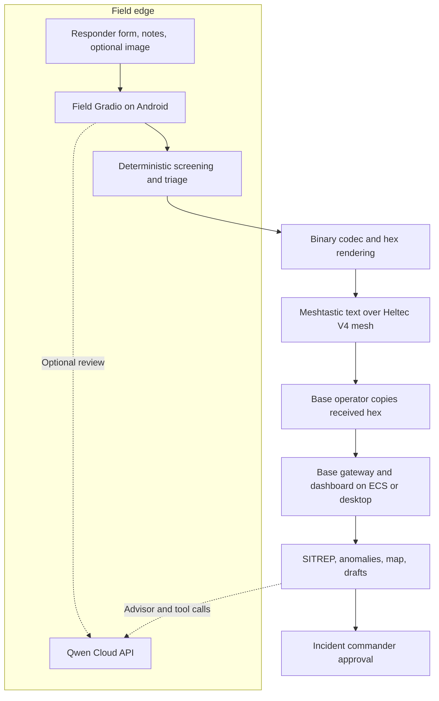
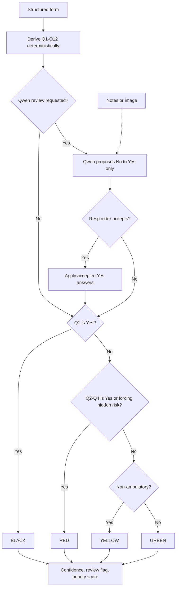
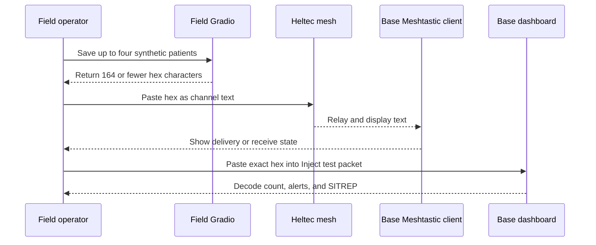
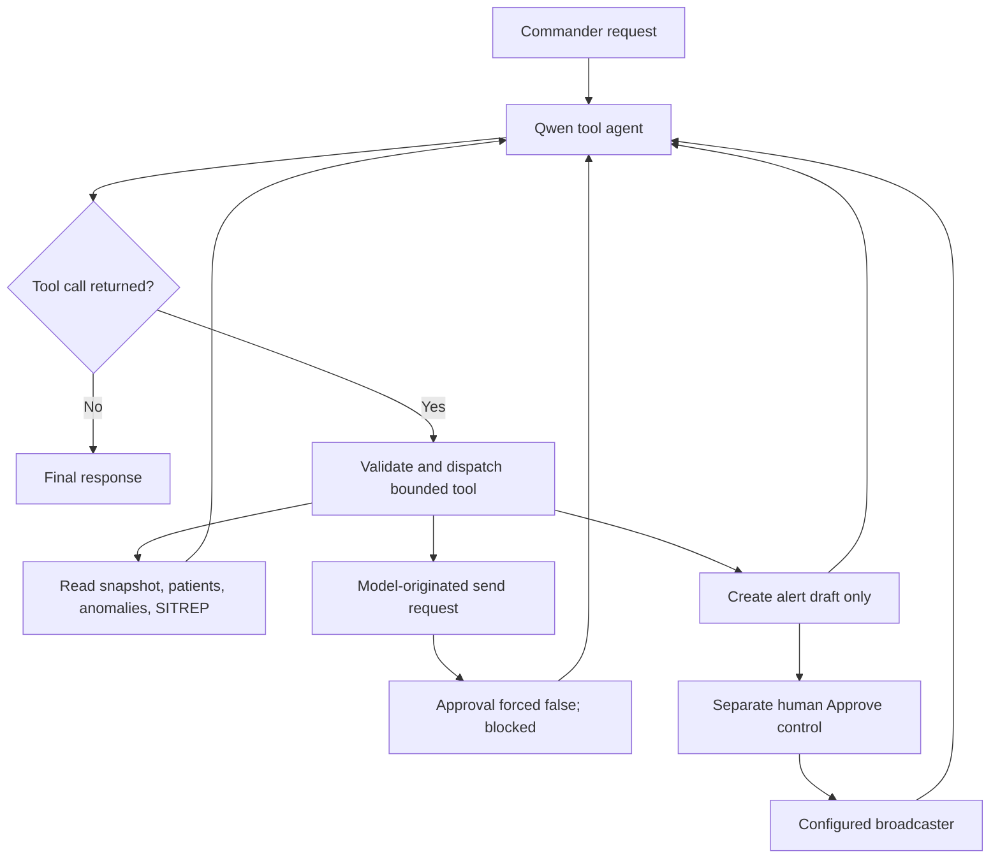
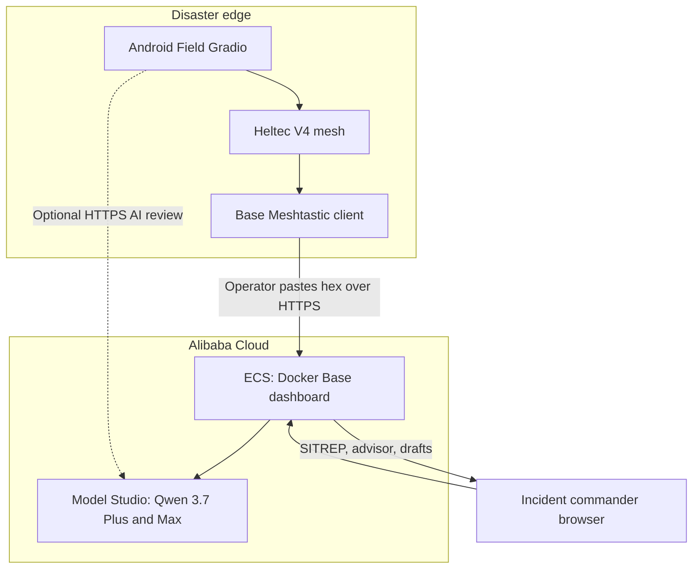

# EmergencyNet architecture

[繁體中文](ARCHITECTURE.zh-TW.md) · [Documentation index](README.md)

This document describes the current connected runtime. Planned integrations are called out explicitly.

## 1. Safety and authority boundaries

| Layer | May do | Must not do |
|---|---|---|
| Deterministic field core | Derive Q1–Q12, tag, hidden risks, confidence, priority, packet | Call the network or delegate the final tag to AI |
| Qwen field review | Interpret notes/images and propose No → Yes changes | Change Yes to No, silently apply a change, or own the tag |
| Field operator | Accept/reject AI suggestions and copy a packet to Mesh | Treat AI output as clinical authority |
| Base gateway | Decode, cap in-memory records, aggregate, detect patterns | Re-triage with an AI shadow model |
| Qwen strategy/agent | Read snapshots, reason, call bounded tools, create drafts | Modify tags or claim a message was sent without a tool result |
| Incident commander | Approve operational decisions and broadcasts | Delegate final accountability to the model |

The system is useful without Qwen: deterministic triage, packet codec, manual mesh relay, base ingestion, SITREP generation, and anomaly detection remain available.

## 2. Current system context

Current transport truth:

- `gradio_app.py` renders hex; it does not call a radio interface.
- Meshtastic relays the hex as an ordinary text message.
- The Base operator pastes that exact text into **Inject test packet**.
- `lora_bridge.py` contains a custom raw `APP_PORT=256` receiver path, but it is not the connected Field-to-Base path described above.
- The Base outbound `MeshAlertBroadcaster` is wired to a no-op demo transport by default. Approval logic can be demonstrated; RF delivery must not be claimed until a real sender is connected.

## 3. Deterministic triage and hidden-risk algorithm

The form-to-tag path is pure Python. The optional AI branch can only add risk evidence after a human accepts it.

Decision details:

- Q1 Yes has precedence and returns BLACK.
- Q2 respiratory threshold, Q3 absent radial pulse, or Q4 inability to follow commands returns RED.
- Hidden risks Q5–Q10 and Q12 are currently `RED_NOW` or `RED_WITHIN_HOUR`, so any of them forces RED. Q11 is monitoring-only.
- If no RED condition fires, a stable non-ambulatory patient is YELLOW; an ambulatory patient is GREEN.
- Missing or invalid values normalize to `Unknown`. Any `Unknown` on Q1, Q5, Q6, Q7, or Q9 forces human review and caps confidence at 0.4. Confidence below 0.6 also forces review.
- Priority is a deterministic sort aid: tag base score, risk bonuses, combined vital flags, airway flag, special-population bonuses, and safety-critical unknown penalties. It is not an independent diagnosis.

### Twelve questions

| Question | Signal | Current consequence when Yes |
|---|---|---|
| Q1 | No breathing after airway reposition | BLACK |
| Q2 | Adult RR >30 or <10; pediatric RR >45 or <15; or rapid/weak category | RED |
| Q3 | Radial pulse absent | RED |
| Q4 | Cannot follow simple commands | RED |
| Q5 | Entrapped for at least 30 minutes | Hidden risk, RED |
| Q6 | Abdominal pain after blunt trauma | Hidden risk, RED |
| Q7 | Pregnancy plus listed warning symptom | Hidden risk, RED |
| Q8 | New altered mental status | Hidden risk, RED |
| Q9 | Face/neck burn, soot, or hoarse voice | Hidden risk, RED |
| Q10 | Significant injury with no pain | Hidden risk, RED |
| Q11 | Older adult, head impact, and confusion | Monitoring risk only |
| Q12 | Near explosion while currently appearing well | Hidden risk, RED |

These thresholds are prototype logic and require clinical governance before real-world use.

## 4. Packet and manual text budget

Packet v1 has a 10-byte header and 18 bytes per patient.

| Segment | Bytes | Content |
|---|---:|---|
| Header | 10 | Version, team, timestamp, count, zone, XOR check |
| Patient ID and GPS | 7 | One-byte ID and fixed-point coordinates |
| Tag and confidence | 1 | 2-bit tag and 6-bit confidence |
| Screening | 3 | Twelve 2-bit answers |
| Risks and walking | 1 | Q5–Q11 flags plus ambulatory bit; Q12 remains in screening bits |
| Raw compact fields | 5 | Age, injury mask, special/vitals, mental/pain/review, entrapment time |
| Patient XOR | 1 | Accidental-corruption check |

Binary capacity is `10 + 12 × 18 = 226` bytes. The manual text route uses two ASCII characters per byte:

| Patients | Binary bytes | Hex text bytes | Manual Meshtastic use |
|---:|---:|---:|---|
| 1 | 28 | 56 | Safe |
| 3 | 64 | 128 | Safe |
| 4 | 82 | 164 | Safe default |
| 5 | 100 | 200 | No margin; avoid for demos |
| 12 | 226 | 452 | Does not fit one text message |

XOR is not authentication. Meshtastic's custom channel PSK protects the channel, but operational sender verification and replay protection are still needed.

## 5. Manual Meshtastic sequence

There are two human copy steps. This is slower than a raw application payload, but it is inspectable and makes the current prototype demonstrable without claiming an unfinished automatic bridge.

## 6. Base aggregation and anomaly algorithm

The gateway decodes valid packets, stores up to `GATEWAY_PATIENT_CAP` records (default 500), and pushes each record into a 30-patient anomaly window.

| Detector | Trigger |
|---|---|
| `RESP_CLUSTER` | At least 5 patients and at least 50% have rapid/weak or absent breathing |
| `BURN_CLUSTER` | At least 3 patients and at least 60% include burn injury |
| `CRUSH_CLUSTER` | At least 3 entrapped patients |
| `RED_SURGE` | At least 5 RED tags within 10 minutes |

Anomalies are advisory. They do not change individual tags. New anomaly types may create an AI draft once; they never auto-send.

## 7. Qwen agent loop

`BaseToolAgent` uses an OpenAI-compatible multi-turn function-calling loop, defaulting to `qwen3.7-plus` and a maximum of six model steps.

Available tools:

- `get_situation_snapshot`
- `list_patients` (capped at 50)
- `list_anomalies`
- `build_sitrep_md`
- `draft_mesh_alert` (body capped at 180 characters)
- `request_send_broadcast` (requires `human_approved=true`)

The model cannot access a tag-mutating tool. A successful tool gate means only that the configured broadcaster returned success; in the default dashboard that broadcaster is a stub, not RF evidence.

## 8. Alibaba Cloud backend

The competition deployment architecture places the Base dashboard/backend container on Alibaba Cloud ECS and uses Alibaba Cloud Model Studio for Qwen inference. The field device can also call Model Studio directly when internet is available.

The deployment proof has two parts:

1. **Code proof:** [`../emergencynet/qwen_client.py`](../emergencynet/qwen_client.py) calls the international DashScope OpenAI-compatible endpoint; `ai_config.py` binds Qwen model roles.
2. **Runtime proof:** show the Base container and logs on an ECS instance, the public demo, and one redacted Model Studio request/response. Never reveal the API key.

See [Alibaba Cloud deployment and proof](ALIBABA_CLOUD.md).

## 9. Failure behaviour

| Failure | Behaviour |
|---|---|
| No API key or internet | AI panels report unavailable; deterministic pipeline remains usable |
| Invalid model JSON | Qwen client/strategy layers attempt bounded JSON extraction/repair, then return a controlled fallback |
| Corrupt packet | Gateway catches the error and returns `MALFORMED_PACKET`; receiver stays alive |
| Too many Field outbox patients | Manual relay UI emits four and retains the remainder for the next message |
| Missing safety-critical answer | Human-review flag and capped confidence |
| AI attempts a send without approval | Tool returns `human_approval_required` |
| Unknown draft ID or no broadcaster | Send tool returns an explicit error |
| Duplicate packet | Currently stored again; replay/deduplication remains a roadmap item |

## 10. Source map

| Concern | Source |
|---|---|
| Form mapping | `emergencynet/screening.py` |
| Deterministic tag and ranking | `emergencynet/triage_core.py`, `risk_engine.py` |
| Packet codec | `emergencynet/bit_packer.py` |
| Field UI | `emergencynet/gradio_app.py` |
| Base ingest and aggregation | `emergencynet/gateway.py`, `anomaly_detector.py` |
| Qwen transport | `emergencynet/qwen_client.py`, `ai_config.py` |
| Strategy | `emergencynet/strategy_ai.py` |
| Agent loop | `emergencynet/base_agent.py` |
| Draft and approval gate | `emergencynet/action_engine.py`, `meshtastic_broadcaster.py` |
| Base UI | `emergencynet/base_dashboard.py` |

## 11. Primary references

- [Qwen Cloud EdgeAgent requirements](https://qwencloud-hackathon.devpost.com/)
- [Alibaba Cloud Model Studio OpenAI compatibility](https://www.alibabacloud.com/help/en/model-studio/compatibility-of-openai-with-dashscope)
- [Alibaba Cloud Model Studio models](https://www.alibabacloud.com/help/en/model-studio/text-generation-model)
- [Meshtastic Heltec LoRa 32 V4](https://meshtastic.org/docs/hardware/devices/heltec-automation/lora32/)
- [Meshtastic Android messages and channels](https://meshtastic.org/docs/software/android/user/messages-and-channels/)
- [Meshtastic encryption limitations](https://meshtastic.org/docs/overview/encryption/)
