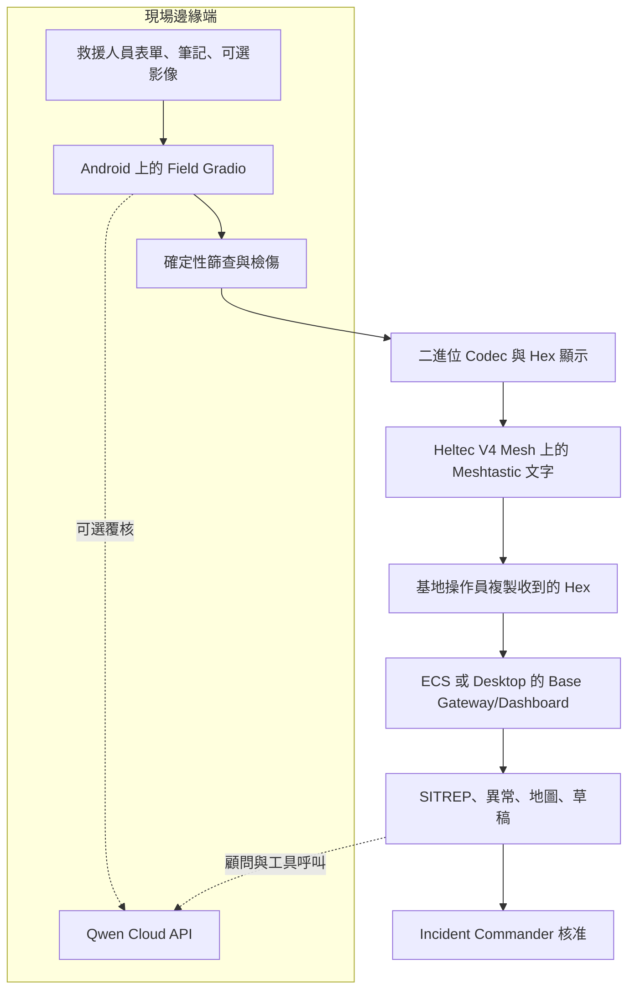
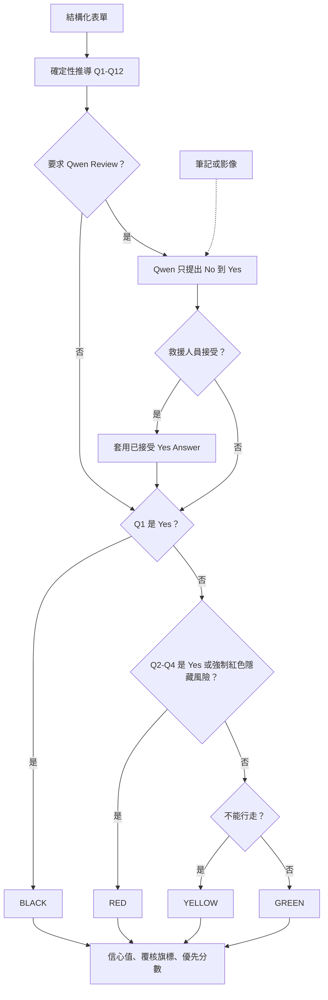
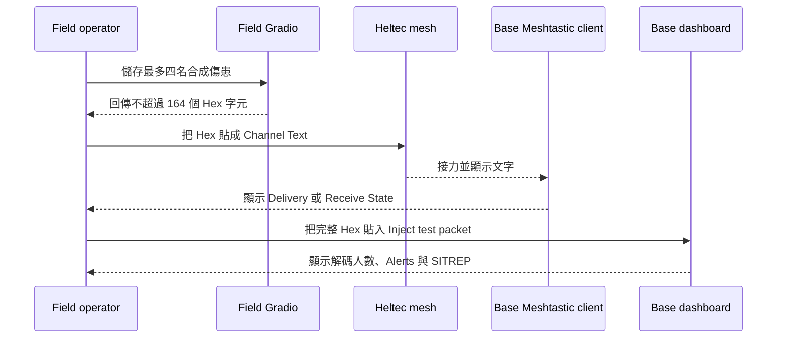
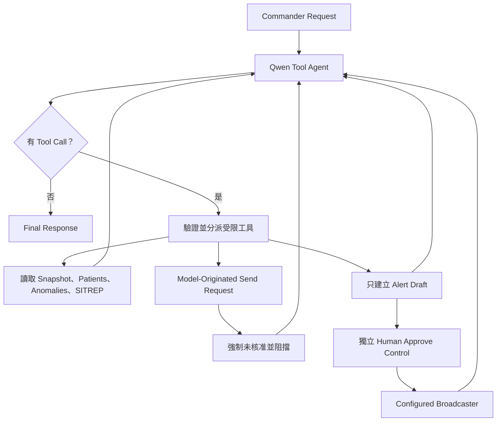
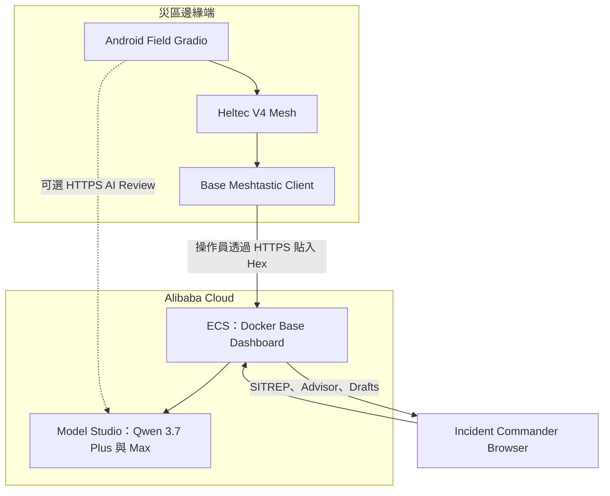

# EmergencyNet 系統架構

[English](ARCHITECTURE.md) · [文件索引](README.zh-TW.md)

本文件只描述目前已接通的 Runtime；未來整合會清楚標成未完成。

## 1. 安全與權限邊界

| 層級 | 可以做 | 不可做 |
|---|---|---|
| 確定性 Field Core | 推導 Q1–Q12、標籤、隱藏風險、信心值、優先分數與封包 | 呼叫網路，或把最終標籤交給 AI |
| Qwen Field Review | 解讀筆記／影像，提出 No → Yes 變更 | 把 Yes 改成 No、靜默套用，或擁有標籤決策權 |
| Field 操作者 | 接受／拒絕 AI 建議，把封包複製到 Mesh | 把 AI 輸出視為臨床權威 |
| Base Gateway | 解碼、限制記憶體資料量、彙整與偵測模式 | 用 AI Shadow Model 重新檢傷 |
| Qwen Strategy／Agent | 讀取 Snapshot、推理、呼叫受限工具、建立草稿 | 修改標籤，或在沒有工具結果時聲稱已發送 |
| Incident Commander | 核准行動決策及廣播 | 把最終責任交給模型 |

沒有 Qwen 時，確定性檢傷、Packet Codec、人工 Mesh 接力、Base Ingest、SITREP 與異常偵測仍可運作。

## 2. 現行系統脈絡

現行傳輸事實：

- `gradio_app.py` 顯示 hex，但不呼叫 Radio Interface。
- Meshtastic 把 hex 當作一般文字訊息接力。
- Base 操作者把該段文字貼到 **Inject test packet**。
- `lora_bridge.py` 內有自訂 Raw `APP_PORT=256` 接收路徑，但它不是上述已接通的 Field-to-Base 路徑。
- Base 的 `MeshAlertBroadcaster` 預設接到 No-op Demo Transport。核准邏輯可示範；真正連接 Sender 前，不可聲稱已完成 RF 傳送。

## 3. 確定性檢傷與隱藏風險演算法

Form-to-Tag 路徑是純 Python。可選 AI Branch 只能在使用者接受後增加風險證據。

決策細節：

- Q1 Yes 優先，直接回傳 BLACK。
- Q2 呼吸閾值、Q3 橈動脈脈搏消失或 Q4 無法遵從指令，回傳 RED。
- Q5–Q10 與 Q12 目前屬於 `RED_NOW` 或 `RED_WITHIN_HOUR`，任何一項都會強制 RED；Q11 只要求監測。
- 若沒有 RED 條件，生命徵象穩定但不能行走為 YELLOW；可行走為 GREEN。
- 缺漏或無效輸入正規化為 `Unknown`。Q1、Q5、Q6、Q7 或 Q9 任何 `Unknown` 均要求人工覆核，且信心值上限為 0.4；信心值低於 0.6 也要求覆核。
- Priority 是確定性的排序輔助：Tag Base Score、Risk Bonus、Vital 組合、Airway、特殊族群與 Safety-Critical Unknown 扣分；它不是獨立診斷。

### 十二條問題

| 問題 | 訊號 | Yes 的現行結果 |
|---|---|---|
| Q1 | Airway Reposition 後仍沒有呼吸 | BLACK |
| Q2 | 成人 RR >30 或 <10；兒童 RR >45 或 <15；或 Rapid/Weak 類別 | RED |
| Q3 | 橈動脈脈搏消失 | RED |
| Q4 | 無法遵從簡單指令 | RED |
| Q5 | 受困至少 30 分鐘 | 隱藏風險、RED |
| Q6 | 鈍性創傷後腹痛 | 隱藏風險、RED |
| Q7 | 懷孕且出現列出的警告症狀 | 隱藏風險、RED |
| Q8 | 新發意識狀態改變 | 隱藏風險、RED |
| Q9 | 臉／頸燒傷、煙灰或聲音沙啞 | 隱藏風險、RED |
| Q10 | 明顯受傷但沒有疼痛 | 隱藏風險、RED |
| Q11 | 長者、頭部撞擊且混亂 | 只要求監測 |
| Q12 | 接近爆炸但目前看似無恙 | 隱藏風險、RED |

這些閾值是原型邏輯；真實使用前必須接受臨床治理審查。

## 4. 封包與人工文字預算

Packet v1 使用 10-byte Header，以及每人 18 bytes。

| 區段 | Bytes | 內容 |
|---|---:|---|
| Header | 10 | Version、Team、Timestamp、Count、Zone、XOR |
| Patient ID 與 GPS | 7 | 1-byte ID 與 Fixed-Point Coordinates |
| Tag 與 Confidence | 1 | 2-bit Tag 與 6-bit Confidence |
| Screening | 3 | 十二個 2-bit Answer |
| Risk 與 Walking | 1 | Q5–Q11 Flags + Ambulatory；Q12 留在 Screening Bits |
| Raw Compact Fields | 5 | Age、Injury Mask、Special/Vitals、Mental/Pain/Review、Entrapment Time |
| Patient XOR | 1 | 意外損壞校驗 |

二進位容量為 `10 + 12 × 18 = 226` bytes。人工文字路徑每個 byte 需要兩個 ASCII 字元：

| 人數 | 二進位 bytes | Hex 文字 bytes | 人工 Meshtastic |
|---:|---:|---:|---|
| 1 | 28 | 56 | 安全 |
| 3 | 64 | 128 | 安全 |
| 4 | 82 | 164 | 安全預設 |
| 5 | 100 | 200 | 沒有餘量，示範時避免 |
| 12 | 226 | 452 | 無法放入單一文字訊息 |

XOR 不是身分驗證。Meshtastic 自訂 Channel PSK 可保護 Channel，但仍需要操作層發送者驗證與 Replay Protection。

## 5. 人工 Meshtastic Sequence

流程有兩個人工複製步驟。它比 Raw Application Payload 慢，但可直接檢查，也能誠實展示目前原型，而不聲稱未完成的自動 Bridge 已存在。

## 6. Base 彙整與異常演算法

Gateway 解碼有效封包，把最多 `GATEWAY_PATIENT_CAP` 筆紀錄保存在記憶體（預設 500），並把每名傷患放入 30 人的 Anomaly Window。

| Detector | Trigger |
|---|---|
| `RESP_CLUSTER` | 至少 5 人，且至少 50% 為 Rapid/Weak 或 Absent Breathing |
| `BURN_CLUSTER` | 至少 3 人，且至少 60% 含 Burn Injury |
| `CRUSH_CLUSTER` | 至少 3 名 Entrapped Patient |
| `RED_SURGE` | 10 分鐘內至少 5 個 RED Tag |

異常只提供建議，不會改動個別標籤。新的 Anomaly Type 最多觸發一次 AI 草稿，絕不自動發送。

## 7. Qwen Agent Loop

`BaseToolAgent` 使用 OpenAI-Compatible Multi-Turn Function Calling，預設模型為 `qwen3.7-plus`，最多六個模型步驟。

可用工具：

- `get_situation_snapshot`
- `list_patients`（最多 50）
- `list_anomalies`
- `build_sitrep_md`
- `draft_mesh_alert`（Body 最多 180 Characters）
- `request_send_broadcast`（要求 `human_approved=true`）

模型無法取得修改標籤的工具。Tool Gate 成功只表示 Configured Broadcaster 回傳成功；預設 Dashboard 使用 Stub，不能當作 RF 證明。

## 8. Alibaba Cloud Backend

競賽部署架構把 Base Dashboard/Backend Container 放在 Alibaba Cloud ECS，並使用 Alibaba Cloud Model Studio 執行 Qwen Inference。Field Device 有網路時也可直接呼叫 Model Studio。

部署證明分成兩部分：

1. **Code Proof：**[`../emergencynet/qwen_client.py`](../emergencynet/qwen_client.py) 呼叫國際 DashScope OpenAI-Compatible Endpoint；`ai_config.py` 綁定 Qwen Model Roles。
2. **Runtime Proof：**顯示 ECS Instance 上的 Base Container 與 Logs、公開 Demo，以及一個遮蔽敏感資料的 Model Studio Request/Response。絕不可暴露 API Key。

詳見 [Alibaba Cloud 部署與證明](ALIBABA_CLOUD.zh-TW.md)。

## 9. 失敗行為

| 失敗 | 行為 |
|---|---|
| 沒有 API Key 或 Internet | AI Panel 顯示不可用；確定性 Pipeline 繼續運作 |
| Model 回傳無效 JSON | Qwen Client/Strategy 進行受限 Extract/Repair，之後回傳受控 Fallback |
| 封包損壞 | Gateway 捕捉錯誤並回傳 `MALFORMED_PACKET`；Receiver 不會崩潰 |
| Field Outbox 太多人 | 人工 Relay UI 每次輸出四人，其餘留待下一段 |
| Safety-Critical Answer 缺漏 | Human-Review Flag 與 Confidence Cap |
| AI 未核准便嘗試 Send | Tool 回傳 `human_approval_required` |
| Draft ID 不明或無 Broadcaster | Send Tool 回傳明確 Error |
| Duplicate Packet | 目前會再次儲存；Replay/Deduplication 是 Roadmap |

## 10. Source Map

| Concern | Source |
|---|---|
| Form Mapping | `emergencynet/screening.py` |
| Deterministic Tag/Ranking | `emergencynet/triage_core.py`、`risk_engine.py` |
| Packet Codec | `emergencynet/bit_packer.py` |
| Field UI | `emergencynet/gradio_app.py` |
| Base Ingest/Aggregation | `emergencynet/gateway.py`、`anomaly_detector.py` |
| Qwen Transport | `emergencynet/qwen_client.py`、`ai_config.py` |
| Strategy | `emergencynet/strategy_ai.py` |
| Agent Loop | `emergencynet/base_agent.py` |
| Draft/Approval Gate | `emergencynet/action_engine.py`、`meshtastic_broadcaster.py` |
| Base UI | `emergencynet/base_dashboard.py` |

## 11. 主要官方來源

- [Qwen Cloud EdgeAgent 要求](https://qwencloud-hackathon.devpost.com/)
- [Alibaba Cloud Model Studio OpenAI Compatibility](https://www.alibabacloud.com/help/en/model-studio/compatibility-of-openai-with-dashscope)
- [Alibaba Cloud Model Studio Models](https://www.alibabacloud.com/help/en/model-studio/text-generation-model)
- [Meshtastic Heltec LoRa 32 V4](https://meshtastic.org/docs/hardware/devices/heltec-automation/lora32/)
- [Meshtastic Android Messages and Channels](https://meshtastic.org/docs/software/android/user/messages-and-channels/)
- [Meshtastic Encryption Limitations](https://meshtastic.org/docs/overview/encryption/)
