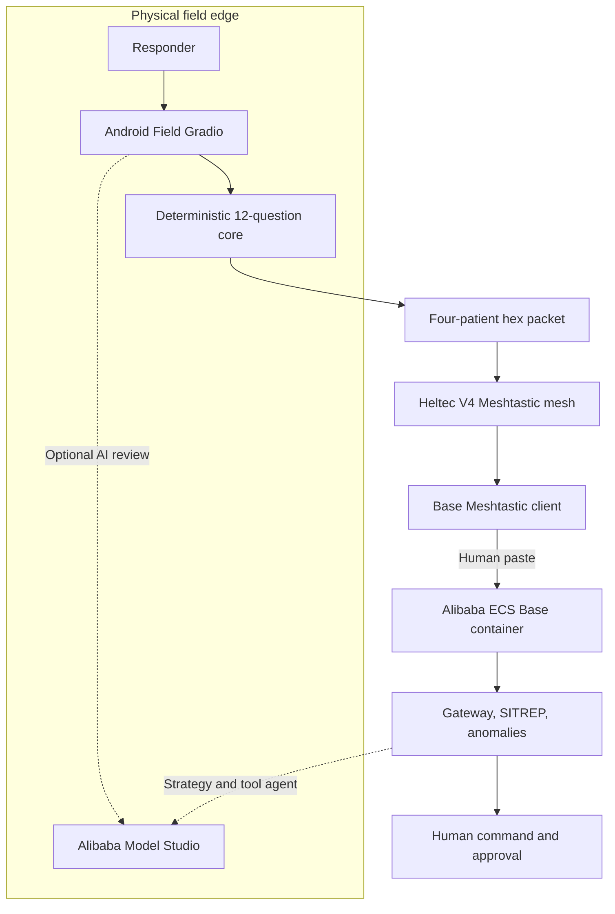

# EmergencyNet — EdgeAgent submission write-up

[繁體中文](WRITEUP_EDGEAGENT.zh-TW.md) · [Pitches and story](PROJECT_STORY.md) · [Architecture](ARCHITECTURE.md)

## Submission identity

- **Project:** EmergencyNet
- **Track:** Track 5 — EdgeAgent
- **Tagline:** Offline-first disaster triage, LoRa-mesh coordination, and human-governed Qwen agents.
- **Team:** `[TEAM NAME / MEMBERS / ROLES]`
- **Repository:** `[PUBLIC GITHUB URL]`
- **Live demo:** `[ALIBABA CLOUD HTTPS URL + JUDGE ACCESS]`
- **Video:** `[PUBLIC VIDEO URL, ABOUT 3 MINUTES]`
- **License:** Apache-2.0

## One-paragraph description

EmergencyNet helps disaster teams keep triage and command coordination functioning when normal internet service is weak or absent. An Android Field app runs a deterministic 12-question triage and hidden-risk engine, while optional Qwen Cloud review can surface clues in multilingual notes or staged images without owning the final tag. Compact records are converted to hex and manually relayed through a Meshtastic LoRa mesh built from Heltec V4 devices. The Dockerized Base dashboard decodes packets, aggregates patient state, detects respiratory/burn/crush/RED-surge patterns, builds SITREPs, and uses Qwen for structured strategy and a bounded function-calling agent. AI may propose escalation and draft messages, but people accept changes and approve every external action.

## What it does

### Field edge

- Captures structured observations, notes, optional exercise images, and manually supplied coordinates.
- Derives Q1–Q12 through pure Python.
- Produces BLACK/RED/YELLOW/GREEN tags with confidence, review flags, rationale, hidden risks, and a priority score.
- Runs the mission-critical path without an API key.
- Uses `qwen3.7-plus` for direct multilingual and vision review when online.
- Accepts only No → Yes AI suggestions after a responder chooses them.
- Encodes a 10-byte header plus 18 bytes per patient.
- Emits independent four-patient hex batches so each message stays below the current Meshtastic text budget.

### Radio mesh

- Uses the Meshtastic Android/Web client and Heltec LoRa 32 V4 nodes.
- Operates on a legally selected region and a private custom-PSK channel.
- Carries hex as ordinary Meshtastic channel text in the current prototype.
- Can demonstrate an endpoint–relay–endpoint topology without conventional infrastructure.

### Base and cloud

- Safely decodes or rejects packets without crashing the receiver.
- Maintains a capped in-memory patient window and zone counts.
- Detects four incident-level patterns without changing individual tags.
- Builds deterministic SITREP summaries.
- Uses `qwen3.7-max` for structured strategy advice.
- Uses `qwen3.7-plus` for a multi-turn tool agent that reads live state and drafts concise alerts.
- Structurally blocks model-fabricated approval; only the separate human UI control may invoke the broadcaster.
- Is packaged as a Docker Base service for Alibaba Cloud ECS and calls Alibaba Cloud Model Studio through DashScope's OpenAI-compatible API; real ECS deployment and proof are still required.

## Current architecture

This diagram is the required submission deployment topology. In the supplied archive, the Base runs on a desktop or Docker host; the ECS node becomes factual only after following the deployment runbook and capturing evidence. There are currently two human copy steps. Direct binary Field TX, automatic Base ingestion, and a real outbound Base radio sender remain roadmap items.

## How we built it

We began with responder workload and failure modes rather than a model prompt. We mapped structured observations into 12 questions, then separated immediate START/JumpSTART-inspired branches from eight hidden-risk rules. The deterministic core became the single tag authority and is shared by every software path.

Next, we designed a packet that preserves tag, confidence, twelve answers, risk signals, approximate coordinates, and compact raw observations inside 18 bytes per patient. We added header and record XOR checks so accidental corruption becomes a controlled `MALFORMED_PACKET` event rather than a receiver crash.

The radio integration uses Meshtastic and Heltec V4. The actual demo copies hex into the app. Auditing the real envelope uncovered an important constraint: 12 binary records fit the raw LoRa budget, but their 452-character hex representation does not fit a normal Meshtastic text message. We changed the Field UI to emit four-patient independent packets at 164 characters.

We then built the Base gateway and aggregate detectors, followed by two Qwen layers. Strategy uses stronger `qwen3.7-max` reasoning and structured JSON repair. The operational agent uses `qwen3.7-plus` function calling with bounded read, SITREP, draft, and send-request tools. Prompt rules alone were insufficient for safety, so the dispatcher now ignores any approval claimed by the model; the only approval path is a separate human action.

Finally, we containerized Field/Base, defined an ECS deployment path, created deterministic bilingual fixtures, and built a judge runbook that exercises radio, cloud, offline, malformed-input, and adversarial approval cases.

## Qwen Cloud implementation

| Feature | Model | API pattern | Control |
|---|---|---|---|
| Field notes and multilingual review | `qwen3.7-plus` | OpenAI-compatible chat + JSON | No → Yes only; operator accepts |
| Field exercise-image review | `qwen3.7-plus` | Multimodal content | Advisory; image excluded from LoRa packet |
| Tactical synthesis | `qwen3.7-plus` | Structured response with offline tables | Whitelist/baseline fallback |
| Base tool agent | `qwen3.7-plus` | Multi-turn tools, max six model steps | No tag tool; model approval overwritten |
| Base strategy advisor | `qwen3.7-max` | Thinking + structured JSON repair | On demand; uncertainty visible |

The transport is implemented in `emergencynet/qwen_client.py`; model and endpoint binding is in `emergencynet/ai_config.py`. No separate translation model is used.

## Offline and weak-network behaviour

| Component | Internet available | Internet unavailable |
|---|---|---|
| Triage/risk/tag | Deterministic | Same deterministic result |
| Multilingual/vision enrichment | Qwen suggestions | Clearly unavailable; no automatic change |
| Packet and mesh | Local encode and RF text relay | Same |
| Base decode/anomalies/SITREP | Local | Same |
| Strategy/agent | Qwen-enhanced | Controlled unavailable/fallback state |

The cloud improves context and synthesis; it is not the single point of failure for the core mission.

## Alibaba Cloud proof description

Replace brackets after real deployment:

> EmergencyNet's Base dashboard/backend runs as a Docker container on Alibaba Cloud ECS in **[REGION]**. The Base receives compact synthetic field packet hex through an authenticated HTTPS interface, performs deterministic decoding, aggregation, anomaly detection, and SITREP generation, and invokes Alibaba Cloud Model Studio for the Qwen strategy advisor and function-calling agent. The implementation uses DashScope's international OpenAI-compatible endpoint. Code proof: **[DIRECT PUBLIC `qwen_client.py` URL]**. Runtime proof: **[PUBLIC PROOF URL]**. Judge demo: **[HTTPS URL + PRIVATE CREDENTIALS]**.

Full deployment and evidence capture: [ALIBABA_CLOUD.md](ALIBABA_CLOUD.md).

## Safety, privacy, and responsible AI

- Prototype—not a certified medical device or autonomous clinical system.
- Human operators own the final triage and broadcast decision.
- AI cannot de-escalate a screening answer or mutate a tag.
- Images stay off the LoRa patient packet.
- Public fixtures are synthetic.
- API keys remain server/device environment secrets.
- A private Meshtastic PSK is required; the default public key is unsuitable.
- XOR detects accidental corruption, not malicious forgery.
- The current public demo needs HTTPS/access control and must contain no real patient data.

## Accomplishments

- Deterministic edge core, compact codec, and graceful offline degradation.
- Multimodal/multilingual Qwen enrichment with explicit escalation boundaries.
- Live aggregate intelligence rather than isolated patient chat.
- Function-calling agent with programmatic human-approval enforcement.
- Realistic manual LoRa-mesh workflow, with its 200-byte text constraint measured and handled.
- Reproducible bilingual setup, tests, fixtures, diagrams, cloud proof, and demo script.

## Challenges and learning

The hardest problem was not maximizing model capability; it was deciding where the model must stop. We learned that reliability matters more than benchmark strength at the edge, fallback must preserve the mission, and human-in-the-loop must be enforced in code. We also learned that transport constraints must be measured at the actual app layer: a binary packet that fits LoRa can still fail after hex expansion.

Team-specific challenges: **[ADD VERIFIED HARDWARE/DEBUGGING/TIMELINE STORY]**.

## What's next

- Direct binary Meshtastic PortNum Field TX and automatic Base ingestion.
- Real human-approved outbound radio sender.
- Cryptographic packet authentication, replay protection, and deduplication.
- Durable incident storage and persistent audit logs.
- Measured multi-hop distance, airtime, latency, loss, and recovery tests.
- Supervised exercises and review by qualified local medical/incident-command leadership.

## Demo and judge path

The three-minute demo should show physical devices, one local deterministic evaluation, one Qwen escalation proposal, Packet A/B crossing the mesh, four Base anomaly types, a tool-generated draft, and the approval boundary. Judges can reproduce every result through [TESTING_GUIDE.md](TESTING_GUIDE.md) without real patient data.

## Required final links

- Source: `[PUBLIC GITHUB URL]`
- Code proof: `[DIRECT qwen_client.py URL]`
- Architecture: `[PUBLIC ARCHITECTURE.md URL]`
- Setup: `[PUBLIC SETUP_GUIDE.md URL]`
- Test guide: `[PUBLIC TESTING_GUIDE.md URL]`
- ECS demo: `[HTTPS URL]`
- Deployment proof: `[PUBLIC URL]`
- Main video: `[PUBLIC URL]`
- Optional build journey: `[PUBLIC BLOG/SOCIAL URL]`
