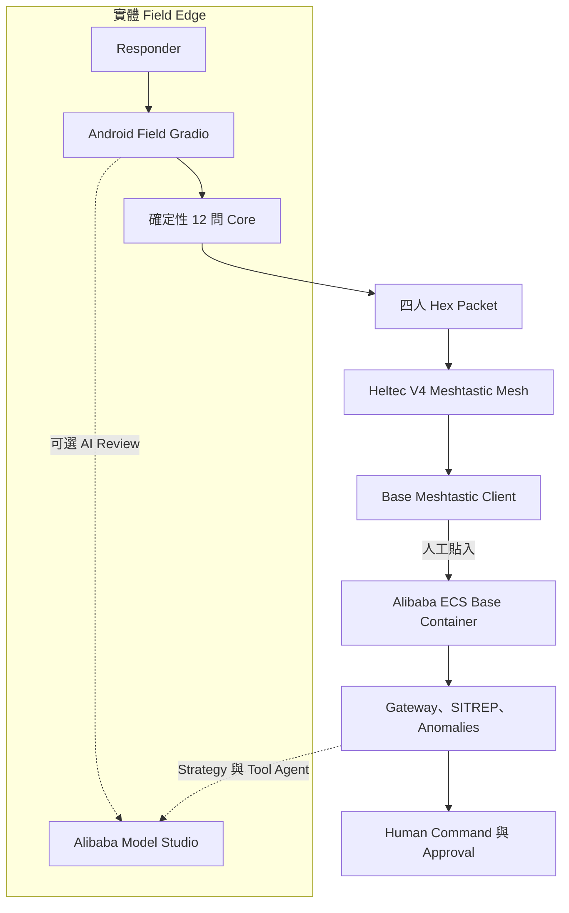

# EmergencyNet — EdgeAgent Submission Write-up

[English](WRITEUP_EDGEAGENT.md) · [Pitch 與 Story](PROJECT_STORY.zh-TW.md) · [Architecture](ARCHITECTURE.zh-TW.md)

## Submission Identity

- **Project：**EmergencyNet
- **Track：**Track 5 — EdgeAgent
- **Tagline：**Offline-first disaster triage, LoRa-mesh coordination, and human-governed Qwen agents.
- **Team：**`[TEAM NAME / MEMBERS / ROLES]`
- **Repository：**`[PUBLIC GITHUB URL]`
- **Live Demo：**`[ALIBABA CLOUD HTTPS URL + JUDGE ACCESS]`
- **Video：**`[PUBLIC VIDEO URL, ABOUT 3 MINUTES]`
- **License：**Apache-2.0

## 一段 Description

EmergencyNet 協助災難隊伍在 Internet 薄弱或中斷時保持檢傷與指揮協調。Android Field App 運行確定性 12 問與 Hidden-Risk Engine；可選 Qwen Cloud Review 可找出多語筆記或演練影像線索，但不擁有最終 Tag。Compact Record 轉成 Hex，經 Heltec V4 Meshtastic LoRa Mesh 人工接力。已 Dockerize 的 Base Dashboard 解碼 Packet、彙整 Patient State、偵測呼吸／燒傷／壓傷／RED Surge Pattern、建立 SITREP，並用 Qwen 提供 Structured Strategy 與受限 Function-Calling Agent。AI 可提出升級及草擬 Message，但人接受所有變更並核准每個 External Action。

## 功能

### Field Edge

- 擷取 Structured Observation、Notes、可選 Exercise Image 與人工 Coordinates。
- 以 Pure Python 推導 Q1–Q12。
- 產生 BLACK/RED/YELLOW/GREEN、Confidence、Review Flag、Rationale、Hidden Risk、Priority Score。
- 沒有 API Key 時 Mission-Critical Path 仍運作。
- 在線時以 `qwen3.7-plus` 直接進行 Multilingual/Vision Review。
- AI 只可提出 No → Yes，且由 Responder 選擇後才套用。
- 10-byte Header + 每人 18 bytes。
- 每次輸出獨立四人 Hex Batch，保持在現行 Meshtastic Text Budget 內。

### Radio Mesh

- 使用 Meshtastic Android/Web Client 與 Heltec LoRa 32 V4。
- 使用按法規選擇的 Region 與自訂 PSK Private Channel。
- 現行 Prototype 把 Hex 當作一般 Meshtastic Channel Text。
- 不依賴傳統 Infrastructure，可展示 Endpoint–Relay–Endpoint Topology。

### Base 與 Cloud

- 安全 Decode／Reject Packet，不令 Receiver 崩潰。
- 維護 Capped In-Memory Patient Window 與 Zone Count。
- 偵測四種 Incident-Level Pattern，不改動 Individual Tag。
- 產生 Deterministic SITREP。
- `qwen3.7-max` 提供 Structured Strategy Advice。
- `qwen3.7-plus` Multi-Turn Tool Agent 讀取 Live State、建立 Concise Alert Draft。
- 結構性阻擋 Model-Fabricated Approval；只有獨立 Human UI Control 可呼叫 Broadcaster。
- 已封裝成供 Alibaba Cloud ECS 使用的 Docker Base Service，並透過 DashScope OpenAI-Compatible API 呼叫 Alibaba Cloud Model Studio；仍須完成真實 ECS 部署與證明。

## 現行 Architecture

此圖是提交時必須實現的 Deployment Topology。所提供 Archive 中的 Base 目前在 Desktop 或 Docker Host 運行；只有完成 Deployment Runbook 並取得證據後，ECS Node 才能作為事實陳述。現時仍有兩次 Human Copy。Direct Binary Field TX、Automatic Base Ingestion 與 Real Outbound Base Radio Sender 仍是 Roadmap。

## How We Built It

我們先研究 Responder Workload 與 Failure Mode，而不是先寫 Model Prompt。Structured Observation 被映射成 12 個問題，再把立即 START/JumpSTART-inspired Branch 與八個 Hidden-Risk Rule 分開。Deterministic Core 成為唯一 Tag Authority，所有 Software Path 共用。

接著設計 Packet：每名 Patient 18 bytes，保留 Tag、Confidence、12 個答案、Risk Signal、Approximate Coordinates 與 Compact Raw Observation。Header/Record XOR 令 Accidental Corruption 變成受控 `MALFORMED_PACKET`，而不是 Receiver Crash。

Radio 使用 Meshtastic + Heltec V4；實際 Demo 把 Hex Copy 到 App。Audit 真實 Envelope 後發現：12 個 Binary Record 可放 Raw LoRa，但 452-character Hex 無法放入一般 Text Message，所以 Field UI 改成 164-character 的四人 Independent Packet。

Base Gateway/Detector 完成後，加入兩個 Qwen Layer。Strategy 用較強 `qwen3.7-max` Reasoning 與 Structured JSON Repair；Operational Agent 用 `qwen3.7-plus` Function Calling，Tool 只允許 Read、SITREP、Draft 與 Send Request。Prompt Rule 不足以保證安全，因此 Dispatcher 會忽略模型聲稱的 Approval；唯一 Approval Path 是獨立 Human Action。

最後把 Field/Base Containerize，定義 ECS Deployment Path，建立 Deterministic Bilingual Fixture 與 Judge Runbook，覆蓋 Radio、Cloud、Offline、Malformed Input、Adversarial Approval。

## Qwen Cloud Implementation

| Feature | Model | API Pattern | Control |
|---|---|---|---|
| Field Notes/Multilingual | `qwen3.7-plus` | OpenAI-Compatible Chat + JSON | No → Yes only；Operator Accept |
| Field Exercise Image | `qwen3.7-plus` | Multimodal Content | Advisory；Image 不入 LoRa Packet |
| Tactical Synthesis | `qwen3.7-plus` | Structured Response + Offline Tables | Whitelist/Baseline Fallback |
| Base Tool Agent | `qwen3.7-plus` | Multi-Turn Tools，最多六步 | 無 Tag Tool；Model Approval 被覆寫 |
| Base Strategy Advisor | `qwen3.7-max` | Thinking + Structured JSON Repair | On Demand；Uncertainty Visible |

Transport 在 `emergencynet/qwen_client.py`；Model/Endpoint Binding 在 `emergencynet/ai_config.py`。沒有 Separate Translation Model。

## Offline／Weak-Network

| Component | Internet Available | Internet Unavailable |
|---|---|---|
| Triage/Risk/Tag | Deterministic | 相同 Deterministic Result |
| Multilingual/Vision | Qwen Suggestions | 清楚顯示不可用；無 Automatic Change |
| Packet/Mesh | Local Encode + RF Text Relay | 相同 |
| Base Decode/Anomaly/SITREP | Local | 相同 |
| Strategy/Agent | Qwen Enhanced | Controlled Unavailable/Fallback |

Cloud 增加 Context/Synthesis，但不是 Core Mission 的 Single Point of Failure。

## Alibaba Cloud Proof Description

真實部署後替換方括號；正式英文提交文字請使用 [English Write-up](WRITEUP_EDGEAGENT.md)：

> EmergencyNet 的 Base Dashboard／Backend 以 Docker Container 運行在 **[REGION]** 的 Alibaba Cloud ECS。Base 透過有身份驗證的 HTTPS Interface 接收精簡合成 Field Packet Hex，完成確定性解碼、彙整、Anomaly Detection 與 SITREP Generation，並呼叫 Alibaba Cloud Model Studio 的 Qwen Strategy Advisor 與 Function-Calling Agent。實作使用 DashScope International OpenAI-Compatible Endpoint。Code Proof：**[DIRECT PUBLIC `qwen_client.py` URL]**。Runtime Proof：**[PUBLIC PROOF URL]**。Judge Demo：**[HTTPS URL + PRIVATE CREDENTIALS]**。

完整 Deployment/Evidence：[ALIBABA_CLOUD.zh-TW.md](ALIBABA_CLOUD.zh-TW.md)。

## Safety、Privacy、Responsible AI

- Prototype，不是獲認證 Medical Device 或 Autonomous Clinical System。
- Human Operator 擁有 Final Triage/Broadcast Decision。
- AI 不可 De-escalate Screening Answer 或 Mutate Tag。
- Image 不進入 LoRa Patient Packet。
- Public Fixture 全是 Synthetic。
- API Key 只存在 Server/Device Environment。
- 必須使用 Private Meshtastic PSK；Default Public Key 不合適。
- XOR 偵測 Accidental Corruption，不防 Malicious Forgery。
- Public Demo 需要 HTTPS/Access Control，並禁止 Real Patient Data。

## Accomplishments

- Deterministic Edge Core、Compact Codec、Graceful Offline Degradation。
- 有明確 Escalation Boundary 的 Multimodal/Multilingual Qwen Enrichment。
- Incident-Level Aggregate Intelligence，而非孤立 Patient Chat。
- 有 Programmatic Human-Approval Enforcement 的 Function-Calling Agent。
- 真實 Manual LoRa-Mesh Workflow，並量度／處理 200-byte Text Constraint。
- 可重現雙語 Setup、Tests、Fixtures、Diagrams、Cloud Proof、Demo Script。

## Challenges / Learning

最難的不是最大化 Model Capability，而是決定 Model 必須在哪裡停止。我們學到 Edge Reliability 比 Benchmark Strength 重要、Fallback 必須保存 Mission、Human-in-the-loop 必須在 Code 強制執行；也學到 Transport Constraint 必須在實際 App Layer 量度——可放進 LoRa 的 Binary Packet 仍可能在 Hex Expansion 後失敗。

Team-Specific Challenges：**[ADD VERIFIED HARDWARE/DEBUGGING/TIMELINE STORY]**。

## What's Next

- Direct Binary Meshtastic PortNum Field TX / Automatic Base Ingestion。
- Real Human-Approved Outbound Radio Sender。
- Cryptographic Packet Authentication、Replay Protection、Deduplication。
- Durable Incident Storage、Persistent Audit Log。
- Measured Multi-Hop Distance、Airtime、Latency、Loss、Recovery Test。
- 受監督 Exercise 與合資格 Local Medical/Incident-Command Review。

## Demo / Judge Path

三分鐘 Demo 應顯示 Physical Device、一次 Local Deterministic Evaluation、一次 Qwen Escalation Proposal、Packet A/B 經 Mesh、Base 四種 Anomaly、Tool Draft 與 Approval Boundary。Judge 可按 [TESTING_GUIDE.zh-TW.md](TESTING_GUIDE.zh-TW.md) 重現，無需真實 Patient Data。

## Required Final Links

- Source：`[PUBLIC GITHUB URL]`
- Code Proof：`[DIRECT qwen_client.py URL]`
- Architecture：`[PUBLIC ARCHITECTURE.md URL]`
- Setup：`[PUBLIC SETUP_GUIDE.md URL]`
- Test Guide：`[PUBLIC TESTING_GUIDE.md URL]`
- ECS Demo：`[HTTPS URL]`
- Deployment Proof：`[PUBLIC URL]`
- Main Video：`[PUBLIC URL]`
- Optional Build Journey：`[PUBLIC BLOG/SOCIAL URL]`
